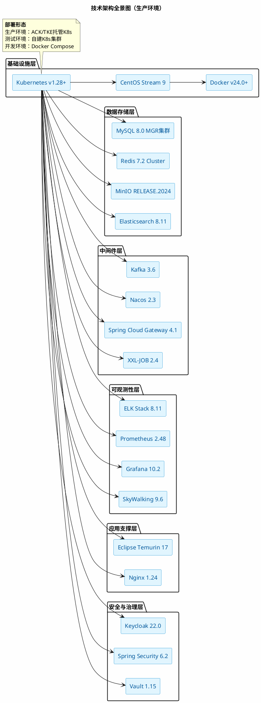
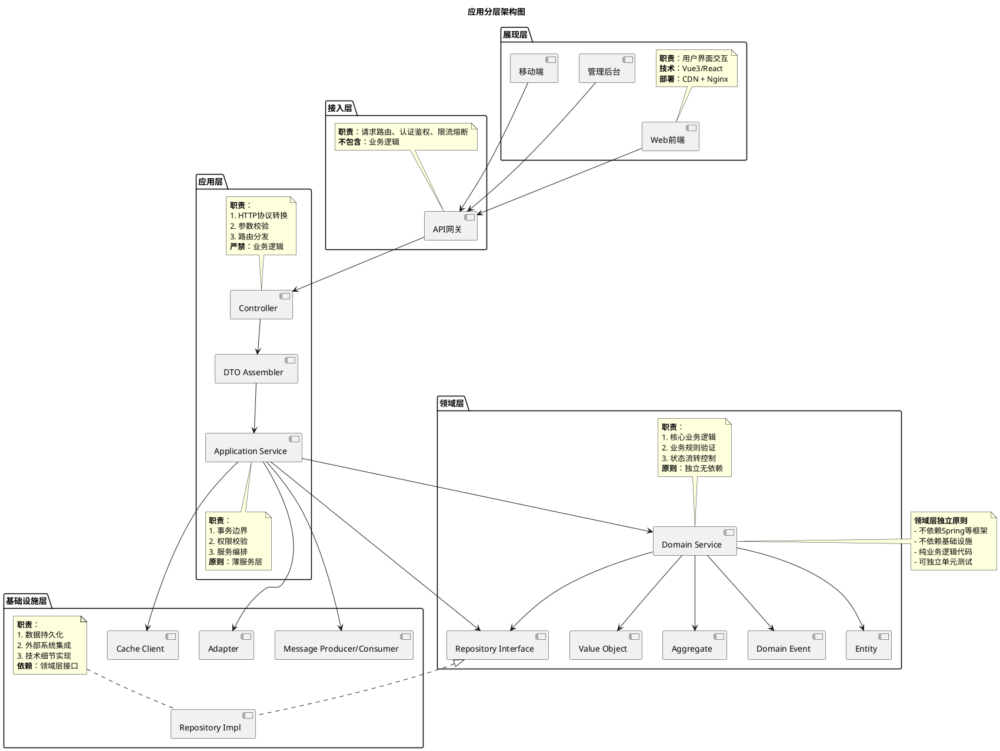
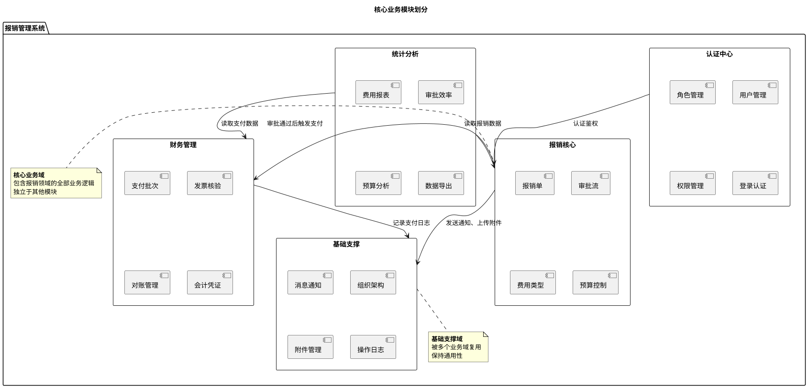
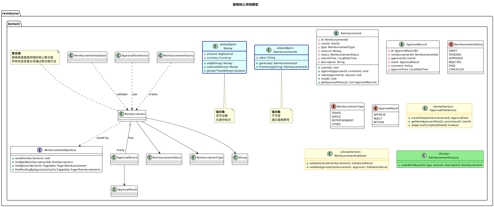
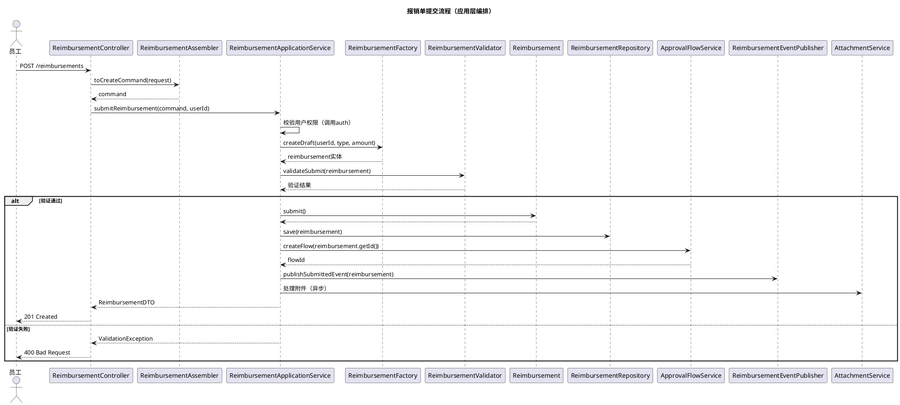
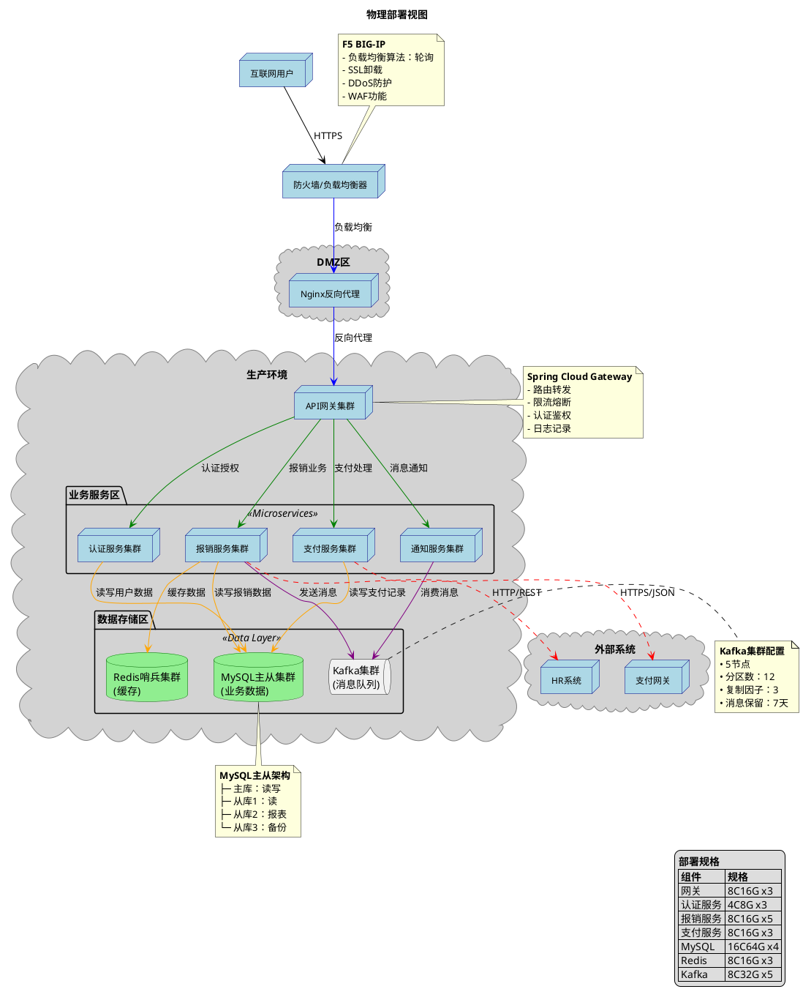
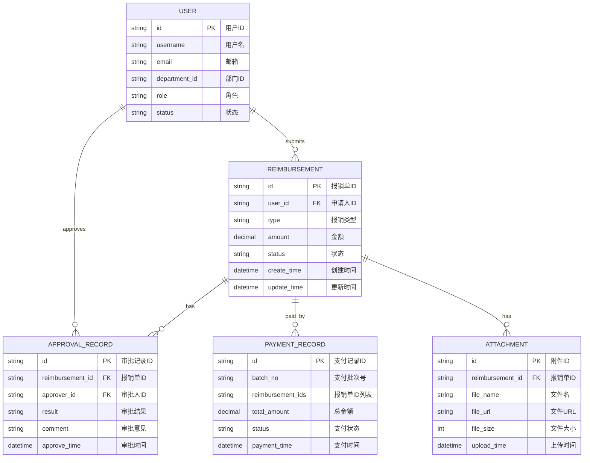

<!--使用说明
  1. 本文档是《软件概要设计说明书》模板。用于以下目的：
    a. 人类与AI智能体协作，作为软件设计工程师，有效且高效地使用本模板为软件产品编制《软件概要设计说明书》的初始版本。
    b. 人类与AI智能体协作，作为软件设计工程师，基于使用本模板编制的《软件概要设计说明书》的某个版本，有效且高效地编制《软件概要设计说明书》的下一版本。
    c. 软件产品经理、软件设计工程师、软件开发工程师、软件测试工程师（负责QC）、软件质量保证工程师（负责QA），无论承担这些角色的到底是人类还是AI智能体，还是二者的组合，有效且高效地评审基于本模板编制的《软件概要设计说明书》。
    d. 《软件概要设计说明书》要把软件产品的骨架（例如，技术架构、业务架构、跨模块业务协作、接口设计、数据库设计、非功能性需求设计、部署运维架构等）描述清楚，但不再描述软件产品的黑盒表面，也不描述业务架构中识别出的业务模块的内部实现。因为黑盒表面应在《软件需求规格说明书》中已完整描述，业务模块的内部实现将在《软件详细设计说明书》中描述。
    e. 《软件概要设计说明书》要覆盖《软件需求规格说明书》中的所有需求，并足以支撑后续的人类与AI智能体协作的软件详细设计。
  2. 《软件概要设计说明书》的编制，是一个不断迭代、更新的过程。
  3. 以软件产品为对象，而不是以软件研发项目为对象，编制《软件概要设计说明书》，以便软件产品的每个版本发布时，与其对应的《软件概要设计说明书》版本准确描述了该版本的软件产品的完整的概要设计。
  4. 要了解当前版本的《软件概要设计说明书》与上一版本的《软件概要设计说明书》的需求变化，应阅读《软件概要设计说明书》的“版本记录”章节，并使用版本比较工具。
-->

<!--请将下面的“<软件产品名称>”替换为准确的软件产品名称，一字不差。-->
# <软件产品名称>
# 软件概要设计说明书

## 版本记录
<!--这里是《软件概要设计说明书》的版本变更记录。
  版本号的编号规则为：<版本完成日期yyyymmdd>-<本文档当日完成序号>
-->
| 版本号| 修订内容 | 作者 | 关联需求规格版本 |
|---|---|---|---|
| yyyymmdd-1 | 基于需求规格说明书创建初版。 | 张三 | 20260112-1 |

## 2. 技术架构
本章描述本系统的技术基础设施架构，即如何搭建出来一个还没有安装我们将要开发的业务模块的“空的”系统。其内容包括，我们将在什么样的服务器、操作系统上安装哪些软件包（例如，操作系统、运行时环境、中间件、数据库、缓存、消息队列等），以及开发环境、测试环境、生产环境的配置，网络规划等。  
本章仅描述最终的选型结果。选型的过程、理由，请阅本文附录。
### 2.1. 技术架构全景图
<!--采用PlantUML绘制技术架构分层示意图，展示从基础设施到应用支撑的完整技术栈。
  1. 全景图展示组件间的部署关系和交互流程，其中应出现逻辑组件（如“Web服务器”、“应用服务器”、“数据库”），而不是具体技术产品（如“Nginx”、“Flask”、“SQLite”）。但在小型系统中，直接标注具体产品也常见且易懂。
  2. 技术栈选型表中的组件，不一定全部出现在全景图中。例如：
    - 开发工具（Vite、Node.js）是构建时工具，不出现在技术架构全景图中。
    - 库和框架（Vue、Pinia、SQLAlchemy）是代码依赖，不出现在技术架构全景图中。
-->

### 2.2. 技术栈选型表
<!--在下表中逐个详细说明上图中的每个组件。
  1. 技术栈选型表展示每个组件的具体技术实现方案，全景图中的每个逻辑组件，都应在技术栈选型表中找到对应的技术实现。例如：
    - 全景图中的“Web服务器” → 选型表中的“Nginx”
    - 全景图中的“后端应用” → 选型表中的“Python Flask”
    - 全景图中的“数据库” → 选型表中的“SQLite”
  2. 版本号必须精确，避免使用“最新版”等模糊表述。
-->
| 层 | 组件 | 选型方案 | 版本 | 部署方式 | 节点数 | 关键配置 |
|---|---|---|---|---|---|---|
| **基础设施** | 容器编排 | Kubernetes | 1.28+ | 托管集群/自建 | ≥5 | etcd集群3节点，控制面3节点 |
| **基础设施** | 操作系统 | CentOS Stream | 9 | 最小化安装 | 所有节点 | 内核5.14+，文件系统XFS |
| **基础设施** | 容器运行时 | Docker | 24.0+ | Systemd托管 | 所有节点 | 存储驱动overlay2，日志json-file |
| **数据存储** | 关系型数据库 | MySQL | 8.0.32+ | MGR集群 | 3 | 引擎InnoDB，字符集utf8mb4，隔离级别RR |
| **数据存储** | 缓存数据库 | Redis | 7.2+ | Cluster集群 | 6(3主3从) | maxmemory-policy allkeys-lru，开启AOF+RDB |
| **数据存储** | 对象存储 | MinIO | RELEASE.2024 | 分布式纠删码 | 8 | EC:4，版本控制开启，生命周期管理 |
| **数据存储** | 搜索引擎 | Elasticsearch | 8.11+ | 主从集群 | 3+5 | 分片3+1，副本1，按天分区 |
| **中间件** | 消息队列 | Kafka | 3.6+ | 集群部署 | 5 | 副本因子3，最小ISR 2，保留7天 |
| **中间件** | 配置/注册中心 | Nacos | 2.3+ | 集群部署 | 3 | 存储MySQL，鉴权开启，命名空间隔离 |
| **中间件** | API网关 | Spring Cloud Gateway | 4.1+ | 集群部署 | ≥2 | Redis限流，Sentinel熔断，路由配置 |
| **中间件** | 任务调度 | XXL-JOB | 2.4+ | 中心化集群 | 2+ | 调度中心集群，执行器自动注册 |
| **可观测性** | 日志系统 | ELK Stack | 8.11+ | 集群部署 | 3+3+3 | Filebeat→Kafka→Logstash→ES |
| **可观测性** | 指标监控 | Prometheus | 2.48+ | 高可用部署 | 2 | 保留15天，抓取15s，远程Thanos |
| **可观测性** | 可视化 | Grafana | 10.2+ | 集群部署 | 2 | 数据源Prometheus，LDAP认证 |
| **可观测性** | 链路追踪 | SkyWalking | 9.6+ | 集群部署 | 2 | 存储ES，采样率10% |
| **应用支撑** | Java运行时 | Eclipse Temurin | 17 LTS | 容器镜像 | - | 基础镜像temurin:17-jre，JVM参数-Xms2g -Xmx2g |
| **应用支撑** | Web服务器 | Nginx | 1.24+ | 容器/二进制 | ≥2 | worker进程auto，TLSv1.3，Gzip开启 |
| **安全与治理** | 身份认证 | Keycloak | 22.0+ | 集群部署 | 3 | 存储PostgreSQL，OIDC/OAuth2协议 |
| **安全与治理** | 权限控制 | Spring Security | 6.2+ | 应用集成 | - | BCrypt加密，无状态会话，JWT RS256 |
| **安全与治理** | 密钥管理 | Vault | 1.15+ | 集群部署 | 3 | 存储Raft，自动解封，审计日志 |
### 2.3. 开发环境说明
| 组件 | 说明 |
|---|---|
| **前端开发服务器** | Vite 4.x，支持热重载，端口5173 |
| **后端开发服务器** | Flask内置服务器，调试模式开启，端口5000 |
| **API代理** | Vite代理配置，将/api请求转发到后端 |
| **数据库文件** | 项目根目录下的`instance/workflow.db` |
| **环境变量** | 通过`.env`文件配置 |
### 2.4 生产环境部署规划
| 项目 | 配置 |
|---|---|
| **部署方式** | 单机部署，Nginx + Flask + SQLite |
| **Nginx端口** | 80（HTTP）、443（HTTPS，如需） |
| **Flask端口** | 127.0.0.1:5000（仅本地监听） |
| **静态文件路径** | `/var/www/workflow-modeler/dist` |
| **数据库文件路径** | `/var/lib/workflow-modeler/data/workflow.db` |
| **日志路径** | `/var/log/workflow-modeler/` |
| **进程管理** | Supervisor管理Flask进程，开机自启 |

## 3. 应用架构
本章描述将要开发的业务系统的内部结构，聚焦于代码层面的组织方式。其内容包括，应用分层、模块划分、包结构、核心业务流程、关键设计模式等。
### 3.1. 应用分层架构
<!--采用PlantUML的组件图，说明本系统的应用分层架构。-->


**分层职责定义：**
<!--将上图中的每个层的细节说明填入下表。-->
| 层次 | 包名 | 职责 | 依赖方向 | 是否必选 |
|------|------|------|---------|---------|
| **展现层** | `ui/` | 用户界面交互，不属后端范围 | → 接入层 | 否 |
| **接入层** | `gateway/` | API路由、认证、限流、跨域 | → 应用层 | 是 |
| **应用层** | `application/` | 事务协调、权限校验、服务编排 | → 领域层 | 是 |
| **领域层** | `domain/` | 核心业务逻辑、业务规则、状态机 | 无外部依赖 | 是 |
| **基础设施层** | `infrastructure/` | 数据持久化、消息发送、外部接口 | → 领域层 | 是 |

**核心约束：**
1. **依赖倒置原则**：领域层不依赖任何其他层，基础设施层依赖领域层接口
2. **严格分层**：上层只能依赖直接下层，禁止跨层依赖
3. **防腐层**：所有外部系统集成必须通过防腐层隔离

### 3.2. 模块划分
<!--采用PlantUML的组件图，说明本系统的核心业务模块划分。-->


**模块详细说明：**
<!--将上图中的每个模块的细节说明填入下表。-->
| 模块名称 | 模块标识 | 核心职责 | 关键聚合根 | 依赖模块 | 被依赖模块 |
|---------|---------|---------|-----------|---------|-----------|
| **认证中心** | `auth` | 用户身份认证、权限控制 | User, Role, Permission | 无 | core, finance, report |
| **报销核心** | `reimburse` | 报销单生命周期管理 | Reimbursement, ApprovalFlow | auth | finance, report |
| **财务管理** | `finance` | 支付处理、发票核验、凭证生成 | PaymentBatch, Invoice | auth, reimburse | report |
| **基础支撑** | `support` | 通用能力复用 | Organization, Notification, Attachment | auth | 所有模块 |
| **统计分析** | `report` | 数据汇总、报表生成、趋势分析 | Report, Dashboard | auth, reimburse, finance | 无 |

**模块边界原则：**
1. **高内聚**：每个模块内的业务逻辑强相关
2. **低耦合**：模块间通过领域事件或API通信
3. **单向依赖**：不允许循环依赖
4. **防腐层**：跨模块调用必须经过防腐层转换

### 3.3. 核心领域模型
<!-- 为上节中的每个模块，建立一个章节，说明其核心领域模型。-->
#### 3.3.1 报销核心领域模型
<!-- 采用PlantUML的类图a描述该模块的领域模型。-->

### 3.4. 包结构设计

```
com.reimburse
├── application                           # 应用层
│   ├── service                          # 应用服务
│   │   ├── ReimbursementApplicationService.java
│   │   ├── ApprovalApplicationService.java
│   │   └── PaymentApplicationService.java
│   ├── assembler                        # DTO组装器
│   │   ├── ReimbursementAssembler.java
│   │   └── ApprovalAssembler.java
│   ├── dto                              # 数据传输对象
│   │   ├── request/
│   │   └── response/
│   └── event                           # 应用事件
│       └── ReimbursementEventPublisher.java
│
├── domain                               # 领域层（核心）
│   ├── reimburse                       # 报销子域
│   │   ├── model                      # 领域模型
│   │   │   ├── Reimbursement.java
│   │   │   ├── ApprovalRecord.java
│   │   │   ├── ReimbursementId.java
│   │   │   ├── ReimbursementStatus.java
│   │   │   └── ReimbursementType.java
│   │   ├── service                    # 领域服务
│   │   │   ├── ApprovalFlowService.java
│   │   │   ├── ReimbursementValidator.java
│   │   │   └── ReimbursementFactory.java
│   │   ├── repository                # 仓储接口
│   │   │   └── ReimbursementRepository.java
│   │   └── event                     # 领域事件
│   │       ├── ReimbursementSubmittedEvent.java
│   │       └── ReimbursementApprovedEvent.java
│   │
│   ├── finance                        # 财务子域
│   │   ├── model/
│   │   ├── service/
│   │   └── repository/
│   │
│   └── common                         # 领域公共组件
│       ├── BaseEntity.java
│       ├── BaseValueObject.java
│       ├── DomainEvent.java
│       └── specification/             # 规格模式
│
├── infrastructure                      # 基础设施层
│   ├── persistence                   # 持久化实现
│   │   ├── dao                      # MyBatis Plus DAO
│   │   ├── repository              # 仓储实现
│   │   └── convert                # 实体转换器
│   ├── message                      # 消息中间件
│   │   ├── producer/
│   │   └── consumer/
│   ├── client                       # 外部服务客户端
│   │   ├── auth/                  # 认证中心客户端
│   │   ├── file/                  # 文件服务客户端
│   │   └── hr/                    # HR系统客户端
│   ├── cache                        # 缓存实现
│   │   └── RedisCacheManager.java
│   └── config                       # 框架配置
│       ├── MybatisConfig.java
│       ├── RedisConfig.java
│       └── KafkaConfig.java
│
├── interfaces                         # 接入层
│   ├── controller                    # REST控制器
│   │   ├── ReimbursementController.java
│   │   ├── ApprovalController.java
│   │   └── PaymentController.java
│   ├── interceptor                  # 拦截器
│   ├── filter                       # 过滤器
│   └── advice                      # 全局异常处理
│
└── start                             # 启动模块
    ├── ReimburseApplication.java
    └── config/
        └── SwaggerConfig.java
```

**包结构原则：**
1. **按业务域分包**，而非按技术层分包
2. **领域层独立**，不依赖Spring注解
3. **基础设施实现**，对应领域层接口
4. **显式边界**，包间依赖清晰可查

### 3.5. 核心业务流程
<!--识别核心业务流程，为每个核心业务流程建立一个章节。-->
#### 3.5.1. 报销单提交流程
<!--采用PlantUML的顺序图描述该流程。-->


**流程要点：**
1. **Controller**：仅做参数转换和路由，无业务逻辑
2. **ApplicationService**：事务边界，服务编排，不包含业务规则
3. **Domain Entity**：业务规则执行，状态变更
4. **Repository**：数据持久化，返回领域对象
5. **EventPublisher**：发布领域事件，解耦后续流程

### 3.6. 关键设计模式应用
<!--将关键设计模式的考虑填入下表。-->
| 设计模式 | 应用场景 | 实现位置 | 解决的问题 |
|---------|---------|---------|-----------|
| **工厂模式** | 报销单、审批流等复杂对象创建 | `domain/*/factory/` | 封装创建逻辑，隐藏构造细节 |
| **策略模式** | 费用计算规则、审批策略 | `domain/*/policy/` | 消除if-else，支持动态扩展 |
| **状态模式** | 报销单状态流转 | `domain/reimburse/model/Reimbursement.java` | 状态变更行为封装在状态类 |
| **规格模式** | 复杂业务规则验证 | `domain/common/specification/` | 规则组合复用，避免逻辑散落 |
| **仓储模式** | 领域对象持久化 | `domain/*/repository/` | 隔离数据访问，领域层独立 |
| **防腐层** | 外部系统集成 | `infrastructure/client/` | 保护领域层不受外部变化影响 |
| **观察者模式** | 领域事件发布订阅 | `domain/*/event/` | 解耦业务流程，支持异步处理 |
| **适配器模式** | 多种外部存储适配 | `infrastructure/persistence/convert/` | 统一访问接口，屏蔽实现差异 |

### 3.7. 领域事件/消息清单
<!--将3,5.节中涉及的领域事件或消息记入下表。-->
| 名称 | 发布时机 | 消费者 | 用途 |
|---------|---------|-------|------|
| `ReimbursementSubmittedEvent` | 报销单提交后 | 通知服务 | 发送提交成功通知 |
| `ReimbursementApprovedEvent` | 报销单最终审批通过 | 支付服务 | 触发支付流程 |
| `ReimbursementRejectedEvent` | 报销单被拒绝 | 通知服务 | 发送拒绝通知 |
| `ReimbursementNodeCompletedEvent` | 审批节点完成 | 通知服务 | 发送下一审批人待办 |
| `PaymentBatchCreatedEvent` | 支付批次创建后 | 对账服务 | 触发对账准备 |
| `AttachmentUploadedEvent` | 附件上传完成后 | 文件服务 | 病毒扫描、图片压缩 |

**领域事件/消息设计原则：**
1. **幂等性**：消费者必须支持重复消费
2. **最终一致性**：事件驱动业务流程
3. **最少事件**：仅发布有明确消费者的业务事件

## 4. 关键接口设计
### 4.1 外部接口（OpenAPI规范）
<!-- 此处可以嵌入或链接到OpenAPI规范文件 -->

```yaml
# openapi/service-external.yaml (节选)
openapi: 3.0.0
info:
  title: 报销管理系统外部API
  version: 1.0.0
  description: 需求关联: SF_001_001, SF_001_002, SF_002_001
  contact:
    name: 技术支持
    email: support@example.com

servers:
  - url: https://api.example.com/v1
    description: 生产环境
  - url: https://api-test.example.com/v1
    description: 测试环境

paths:
  /reimbursements:
    post:
      summary: 创建报销单
      operationId: createReimbursement
      tags:
        - 报销单
      security:
        - BearerAuth: []
      requestBody:
        required: true
        content:
          application/json:
            schema:
              $ref: '#/components/schemas/CreateReimbursementRequest'
            example:
              type: "TRAVEL"
              amount: 1250.50
              description: "上海出差交通费"
              attachments: ["https://oss.example.com/invoice1.jpg"]
      responses:
        '201':
          description: 创建成功
          content:
            application/json:
              schema:
                $ref: '#/components/schemas/ReimbursementResponse'
        '400':
          description: 请求参数错误
        '401':
          description: 未授权
        '500':
          description: 服务器内部错误

components:
  securitySchemes:
    BearerAuth:
      type: http
      scheme: bearer
      bearerFormat: JWT
  
  schemas:
    CreateReimbursementRequest:
      type: object
      required:
        - type
        - amount
      properties:
        type:
          type: string
          enum: [TRAVEL, OFFICE, ENTERTAINMENT]
          description: 报销类型
        amount:
          type: number
          format: double
          minimum: 0.01
          maximum: 10000.00
          description: 报销金额
        description:
          type: string
          maxLength: 500
        attachments:
          type: array
          items:
            type: string
            format: uri
```

### 4.2 内部服务接口
<!--将内部服务接口填入下表。-->
| 接口名称 | 提供方 | 消费方 | 协议 | 关键字段 | 关联需求 | SLA要求 |
|---|---|---|---|---|---|---|
| 获取用户信息 | auth-service | reimb-service | REST | userId, userName, department, role | SF_001_001 | 响应时间<100ms，可用性99.9% |
| 发送审批通知 | notify-service | reimb-service | Kafka | eventType, targetUser, content, timestamp | SF_002_001 | 消息延迟<1s，至少投递一次 |
| 获取报销单状态 | reimb-service | payment-service | REST | reimbursementId, status, amount, approver | SF_002_001 | 响应时间<200ms |
| 上传文件 | file-service | reimb-service | REST | file, fileName, fileType, userId | SF_001_001 | 上传速度>1MB/s |
| 验证权限 | auth-service | api-gateway | REST | token, resource, action | SQ_安全_001 | 响应时间<50ms |

## 5. 物理部署视图
<!--采用PlantUML的组件图描述本系统的物理部署视图。-->


## 6. 数据库设计
### 6.1. ER图（核心部分）
<!--采用Mermaid图描述数据库ER图。-->


### 6.2. 核心表清单
<!--将核心的数据库表的细节说明填入下表。-->
| 表名 | 英文名 | 主要字段 | 数据量预估 | 关联需求 | 分表策略 |
|---|---|---|---|---|---|
| 用户表 | user | id, username, email, department_id, role, status | 1000 | SF_001_001 | 不分表 |
| 报销单表 | reimbursement | id, user_id, type, amount, status, create_time | 100万/年 | SF_001_001 | 按create_time季度分表 |
| 审批记录表 | approval_record | id, reimbursement_id, approver_id, result, comment | 300万/年 | SF_002_001 | 按reimbursement_id哈希分表 |
| 支付记录表 | payment_record | id, batch_no, reimbursement_ids, total_amount, status | 50万/年 | SF_002_001 | 按batch_no分表 |
| 附件表 | attachment | id, reimbursement_id, file_name, file_url, file_size | 200万/年 | SF_001_001 | 按reimbursement_id分表 |
| 操作日志表 | operation_log | id, user_id, operation_type, target_id, ip, user_agent | 500万/年 | SQ_安全_002 | 按月分表 |

## 7. 对非功能性需求和其它需求的设计
本章对软件需求规格说明书中的非功能性需求和其它需求章节中的需求进行设计。
### 7.1. 标准与规范
<!--说明软件需求规格说明书中的标准与规范类需求的实现中应注意事项。-->

### 7.2. 运行环境
<!--说明软件需求规格说明书中的运行环境类需求的实现中应注意事项。-->

### 7.3. 安全
<!--对软件需求规格说明书中的安全类需求进行设计。-->

- **认证方式**：JWT Token，有效期2小时，刷新令牌14天
- **权限控制**：RBAC模型，接口级别权限验证，支持数据级权限
- **数据加密**：
  - 敏感字段（金额、银行卡号）AES-256-GCM加密存储
  - 传输层使用TLS 1.3
  - 配置文件中的敏感信息使用Vault或KMS管理
- **安全审计**：
  - 所有关键操作记录完整审计日志
  - 异常登录行为检测（异地登录、频繁失败）
  - 定期安全扫描和渗透测试
### 7.4. 性能设计
<!--对软件需求规格说明书中的性能类需求进行设计。-->

- **缓存策略**：
  - 用户基本信息：Redis缓存24小时
  - 报销单列表：Redis缓存5分钟，按用户ID分区
  - 审批流程配置：本地缓存30分钟 + Redis备份
- **数据库优化**：
  - 报销单表按create_time季度分表
  - 审批记录表按reimbursement_id哈希分表
  - 关键查询字段建立复合索引
  - 慢查询监控阈值设置为500ms
- **接口限流**：
  - 创建报销单接口：每个用户10次/分钟
  - 查询接口：每个IP 100次/分钟
  - 支付接口：每个用户5次/分钟
- **CDN加速**：静态资源（JS、CSS、图片）使用CDN分发

### 7.5. 国际化
<!--对软件需求规格说明书中的国际化类需求进行设计。-->

### 7.6. 其它需求
<!--对软件需求规格说明书中的其它需求进行设计。-->

## 8. 附录：技术选型过程与决策理由
本章记录技术方案选型的过程和决策理由。
<!--为每一个需要选型的技术方案，建立一个章节。-->
### 8.1. <选型事项>
<!--在下表中记录本次选型的过程和决策理由。-->
| 候选方案 | 关键优点 | 关键缺点 | 选型结果 | 决策理由 | 
|---|---|---|---|---|
| ... | ... | ... | ... | ... |

<!--下面是本模板的版本号，而不是《软件概要设计说明书》的版本号。-->
```text
模板版本号：20260223-1
```
**全文结束**