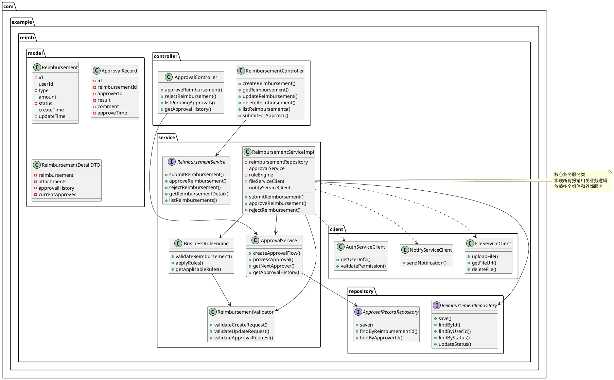
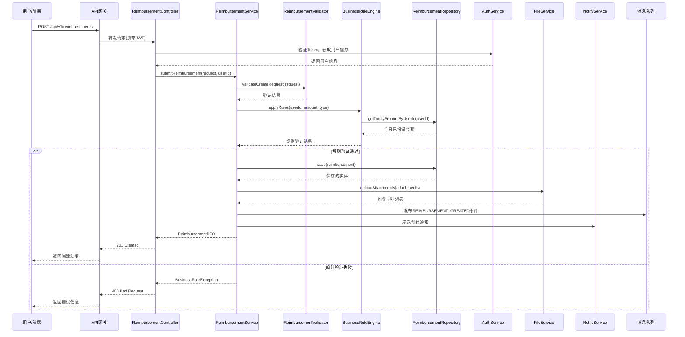

<!--使用说明
  1. 本文档是《软件详细设计说明书》模板。用于以下目的：
    a. 人类与AI智能体协作，作为软件开发工程师，有效且高效地使用本模板为软件产品编制《软件详细设计说明书》的初始版本。
    b. 人类与AI智能体协作，作为软件开发工程师，基于使用本模板编制的《软件详细设计说明书》的某个版本，有效且高效地编制《软件详细设计说明书》的下一版本。
    c. 软件设计工程师、软件开发工程师、软件质量保证工程师（负责QA），无论承担这些角色的到底是人类还是AI智能体，还是二者的组合，有效且高效地评审基于本模板编制的《软件详细设计说明书》。
    d. 《软件详细设计说明书》要把软件产品的某个模块的具体实现方法描述清楚。
    e. 《软件详细设计说明书》要足以支撑后续的人类与AI智能体协作的软件编码。
  2. 《软件详细设计说明书》的编制，是一个不断迭代、更新的过程。
  3. 以软件产品为对象，而不是以软件研发项目为对象，编制《软件详细设计说明书》，以便软件产品的每个版本发布时，与其对应的《软件详细设计说明书》版本准确描述了该版本的软件产品的各模块的完整的详细设计。
  4. 要了解当前版本的《软件详细设计说明书》与上一版本的《软件详细设计说明书》的需求变化，应阅读《软件详细设计说明书》的“版本记录”章节，并使用版本比较工具。
-->

<!--请将下面的“<软件产品名称>”替换为准确的软件产品名称，一字不差。-->
# <软件产品名称>
# 详细设计说明书
# 模块名：reimb-service

## 版本记录
| 版本号 | 修订内容 | 作者 | 关联概要设计版本 |
|---|---|---|---|
| yyyymmdd_1 | 初版创建 | 李四 | 20260112_1 |

## 1. 模块概述

### 1.1 模块职责
<!-- 本模块负责的具体业务功能 -->
- 报销单的创建、查询、修改、删除（CRUD）
- 报销审批流程的状态管理和流转
- 报销业务规则验证和执行
- 报销单的统计和报表生成
- 与其他模块的协作（支付、通知、文件等）

### 1.2 技术特性
- **开发框架**: Spring Boot 3.2.0
- **数据库**: MySQL 8.0 + MyBatis Plus
- **缓存**: Redis 7.2
- **消息**: Kafka 3.6
- **API风格**: RESTful
- **部署方式**: Docker容器化

### 1.3 关联需求
<!-- 本模块实现的所有需求 -->
- SF_001_001: 填写报销单
- SF_001_002: 查询报销进度
- SF_002_001: 审批报销单（部分）
- SQ_性能_001: 页面响应时间<2s
- SQ_接口_001: HR系统集成
- BR-001 ~ BR-005: 业务规则

### 1.4 模块边界
- **输入边界**: REST API请求、Kafka消息、定时任务
- **输出边界**: 数据库持久化、Kafka事件、外部服务调用
- **依赖服务**: auth-service, file-service, notify-service, payment-service
- **外部依赖**: HR系统API、公司组织架构服务

## 2. 类设计

### 2.1 核心类图



### 2.2 类详细说明

#### 2.2.1 ReimbursementService接口
**类名：** ReimbursementService  
**包名：** com.example.reimb.service  
**类型：** 业务服务接口  
**职责：** 定义报销业务的核心操作  
**需求关联：** SF_001_001, SF_001_002, SF_002_001

```
/**
 * 报销业务服务接口
 * @requirement SF_001_001, SF_001_002, SF_002_001
 */
public interface ReimbursementService {
    
    /**
     * 提交报销单
     * @param request 报销请求数据
     * @param userId 用户ID
     * @return 创建的报销单信息
     * @requirement SF_001_001
     */
    ReimbursementDTO submitReimbursement(CreateReimbursementRequest request, String userId);
    
    /**
     * 获取报销单详情
     * @param reimbursementId 报销单ID
     * @param userId 用户ID（用于权限验证）
     * @return 报销单详细信息
     * @requirement SF_001_002
     */
    ReimbursementDetailDTO getReimbursementDetail(String reimbursementId, String userId);
    
    /**
     * 查询报销单列表
     * @param query 查询条件
     * @param userId 用户ID
     * @return 报销单列表
     * @requirement SF_001_002
     */
    PageResult<ReimbursementDTO> listReimbursements(ReimbursementQuery query, String userId);
    
    /**
     * 审批报销单
     * @param reimbursementId 报销单ID
     * @param request 审批请求
     * @param approverId 审批人ID
     * @return 审批结果
     * @requirement SF_002_001
     */
    ApprovalResultDTO approveReimbursement(String reimbursementId, ApprovalRequest request, String approverId);
    
    /**
     * 拒绝报销单
     * @param reimbursementId 报销单ID
     * @param request 拒绝请求
     * @param approverId 审批人ID
     * @return 拒绝结果
     * @requirement SF_002_001
     */
    RejectionResultDTO rejectReimbursement(String reimbursementId, RejectionRequest request, String approverId);
}
```

#### 2.2.2 ReimbursementServiceImpl类
**类名：** ReimbursementServiceImpl  
**包名：** com.example.reimb.service.impl  
**类型：** 业务服务实现类  
**职责：** 实现报销业务的核心逻辑  
**需求关联：** SF_001_001, SF_001_002, SF_002_001

```yaml
# 结构化设计描述 - ReimbursementServiceImpl.submitReimbursement方法
class: ReimbursementServiceImpl
package: com.example.reimb.service.impl
requirement: 
  - SF_001_001
  - BR-001
  - BR-002
methods:
  - name: submitReimbursement
    signature: ReimbursementDTO submitReimbursement(CreateReimbursementRequest request, String userId)
    description: 提交报销单的核心业务方法
    input:
      - name: request
        type: CreateReimbursementRequest
        validation:
          - notNull
          - fields: [type, amount]
          - amount: {min: 0.01, max: 10000.00}
      - name: userId
        type: String
        validation: notBlank
    output:
      type: ReimbursementDTO
      fields:
        - reimbursementId: String
        - status: String
        - createTime: LocalDateTime
    steps:
      # 步骤1：验证用户权限
      - action: validateUserPermission
        description: 验证用户是否有权限提交报销单
        implementation: |
          // 调用auth-service验证用户状态
          UserInfo userInfo = authServiceClient.getUserInfo(userId);
          if (userInfo == null || !"ACTIVE".equals(userInfo.getStatus())) {
            throw new AuthorizationException("用户无权限或状态异常");
          }
        exception: AuthorizationException
        
      # 步骤2：数据验证
      - action: validateRequestData
        description: 验证请求数据的合法性
        implementation: |
          // 调用验证器进行数据验证
          ValidationResult result = reimbursementValidator.validateCreateRequest(request);
          if (!result.isValid()) {
            throw new ValidationException(result.getErrors());
          }
        exception: ValidationException
        
      # 步骤3：应用业务规则
      - action: applyBusinessRules
        description: 应用业务规则（金额限制、发票规则等）
        implementation: |
          // 调用规则引擎应用业务规则
          RuleContext context = RuleContext.builder()
              .userId(userId)
              .amount(request.getAmount())
              .type(request.getType())
              .build();
          
          RuleResult ruleResult = businessRuleEngine.applyRules(context);
          if (!ruleResult.isPassed()) {
            throw new BusinessRuleException(ruleResult.getRejectReason());
          }
        exception: BusinessRuleException
        
      # 步骤4：构建实体并保存
      - action: saveReimbursement
        description: 构建报销单实体并保存到数据库
        implementation: |
          // 构建报销单实体
          Reimbursement reimbursement = Reimbursement.builder()
              .id(generateReimbursementId())
              .userId(userId)
              .type(request.getType())
              .amount(request.getAmount())
              .description(request.getDescription())
              .status(ReimbursementStatus.DRAFT)
              .createTime(LocalDateTime.now())
              .build();
          
          // 保存到数据库
          reimbursement = reimbursementRepository.save(reimbursement);
          
          // 保存附件关联（如果有）
          if (CollectionUtils.isNotEmpty(request.getAttachments())) {
            saveAttachments(reimbursement.getId(), request.getAttachments());
          }
        
      # 步骤5：发送通知
      - action: sendNotification
        description: 发送报销单创建通知
        implementation: |
          // 异步发送通知
          NotificationEvent event = NotificationEvent.builder()
              .eventType("REIMBURSEMENT_CREATED")
              .targetUser(userId)
              .content(String.format("报销单%s已创建", reimbursement.getId()))
              .build();
          
          notifyServiceClient.sendNotification(event);
        async: true
        
      # 步骤6：返回结果
      - action: buildResponse
        description: 构建返回的DTO对象
        implementation: |
          return ReimbursementDTO.builder()
              .reimbursementId(reimbursement.getId())
              .type(reimbursement.getType())
              .amount(reimbursement.getAmount())
              .status(reimbursement.getStatus().name())
              .createTime(reimbursement.getCreateTime())
              .build();
    
    cache_strategy:
      - type: write_through
        key_pattern: "reimbursement:#{result.reimbursementId}"
        ttl: 300  # 5分钟
        
    transaction:
      propagation: REQUIRED
      isolation: READ_COMMITTED
      timeout: 30  # 30秒
      
    metrics:
      - name: reimbursement_submit_duration
        type: histogram
        tags: [type: #{request.type}]
      - name: reimbursement_submit_total
        type: counter
        tags: [result: success/failure]
```

#### 2.2.3 BusinessRuleEngine类
**类名：** BusinessRuleEngine  
**包名：** com.example.reimb.rule  
**类型：** 业务规则引擎  
**职责：** 执行业务规则验证  
**需求关联：** BR-001, BR-002, BR-003, BR-004, BR-005

```yaml
# 结构化设计描述 - BusinessRuleEngine
class: BusinessRuleEngine
package: com.example.reimb.rule
description: 业务规则引擎，负责所有报销业务规则的执行
requirement: BR-001, BR-002, BR-003, BR-004, BR-005
design_pattern: 策略模式 + 责任链模式

rules:
  - id: amount_limit_rule
    name: 单笔金额限制规则
    priority: 1
    condition: context.amount > 10000
    action: |
      return RuleResult.failed("单笔报销金额不能超过10000元");
    requirement: BR-001
    
  - id: daily_limit_rule
    name: 单日累计限制规则
    priority: 2
    condition: |
      // 查询用户今日已报销金额
      BigDecimal todayAmount = getTodayReimbursementAmount(context.userId);
      return todayAmount.add(context.amount).compareTo(new BigDecimal("50000")) > 0;
    action: |
      return RuleResult.failed("单日累计报销金额不能超过50000元");
    requirement: BR-001
    implementation_notes: |
      1. 需要查询数据库获取用户今日报销总额
      2. 考虑缓存今日金额以提高性能
      3. 每日凌晨需要清除缓存
      
  - id: invoice_required_rule
    name: 发票必须上传规则
    priority: 3
    condition: |
      context.amount > 500 && 
      (context.attachments == null || context.attachments.isEmpty())
    action: |
      return RuleResult.failed("单张发票金额超过500元必须上传发票");
    requirement: BR-002
    
  - id: approver_permission_rule
    name: 审批人权限规则
    priority: 4
    condition: |
      // 检查审批人是否有权限审批此金额
      UserLevel approverLevel = getUserLevel(context.approverId);
      BigDecimal maxAmount = getMaxApprovalAmount(approverLevel);
      return context.amount.compareTo(maxAmount) > 0;
    action: |
      return RuleResult.failed("审批人无权限审批此金额的报销单");
    requirement: BR-005
    scope: APPROVAL_CONTEXT
    
  - id: approval_timeout_rule
    name: 审批时限规则
    priority: 5
    condition: |
      // 检查报销单是否超过审批时限
      Duration pendingDuration = getPendingDuration(context.reimbursementId);
      return pendingDuration.toHours() > 48;
    action: |
      // 超时后自动升级到上级审批
      escalateToHigherApprover(context.reimbursementId);
      return RuleResult.passedWithAction("已自动升级审批");
    requirement: BR-004
    scope: APPROVAL_CONTEXT
    
rule_engine_config:
  execution_mode: SEQUENTIAL  # 顺序执行
  stop_on_failure: true       # 遇到失败即停止
  cache_enabled: true         # 启用规则缓存
  cache_ttl: 600             # 缓存10分钟
  
extension_points:
  - name: custom_rule_loader
    interface: RuleLoader
    description: 支持从数据库或配置文件加载自定义规则
  - name: rule_event_publisher
    interface: RuleEventPublisher
    description: 规则执行事件发布，用于监控和审计
```

## 3. 接口详细设计

### 3.1 REST API详细设计

#### 3.1.1 POST /api/v1/reimbursements
**关联需求：** SF_001_001  
**优先级：** 4.3  
**接口描述：** 创建新的报销单

```yaml
api:
  path: /api/v1/reimbursements
  method: POST
  summary: 创建报销单
  description: 用户提交报销申请，系统创建报销单并启动审批流程
  requirement: SF_001_001
  security:
    - BearerAuth: []
  request:
    headers:
      - name: Authorization
        required: true
        type: string
        example: "Bearer eyJhbGciOiJIUzI1NiIsInR5cCI6IkpXVCJ9..."
      - name: X-Request-ID
        required: false
        type: string
        description: 请求ID，用于链路追踪
    body:
      type: application/json
      schema:
        $ref: '#/components/schemas/CreateReimbursementRequest'
      validation:
        - required_fields: [type, amount]
        - amount_range: {min: 0.01, max: 10000.00}
        - description_max_length: 500
      examples:
        travel_expense:
          summary: 差旅费报销
          value:
            type: "TRAVEL"
            amount: 1250.50
            description: "上海出差交通费"
            attachments: ["https://oss.example.com/invoice1.jpg", "https://oss.example.com/ticket2.jpg"]
        office_expense:
          summary: 办公费报销
          value:
            type: "OFFICE"
            amount: 850.00
            description: "购买办公用品"
            
  response:
    success:
      code: 201
      description: 报销单创建成功
      headers:
        Location:
          description: 新创建的报销单资源地址
          example: "/api/v1/reimbursements/REIM-20240615-001"
      body:
        type: application/json
        schema:
          $ref: '#/components/schemas/ReimbursementDTO'
        example:
          reimbursementId: "REIM-20240615-001"
          type: "TRAVEL"
          amount: 1250.50
          status: "DRAFT"
          createTime: "2024-06-15T10:30:00Z"
          
    errors:
      - code: 400
        description: 请求参数错误
        body:
          type: application/json
          schema:
            $ref: '#/components/schemas/ErrorResponse'
          example:
            errorCode: "VALIDATION_ERROR"
            message: "报销金额不能超过10000元"
            details: ["amount: 必须小于或等于10000"]
            
      - code: 401
        description: 未授权
      - code: 403
        description: 权限不足
      - code: 429
        description: 请求过于频繁
        headers:
          Retry-After:
            description: 建议的重试时间（秒）
            example: "60"
      - code: 500
        description: 服务器内部错误
        
  rate_limit:
    strategy: user_based
    limit: 10
    period: 60  # 每分钟10次
    scope: user_id
    
  circuit_breaker:
    enabled: true
    failure_threshold: 5
    timeout: 5000  # 5秒超时
    
  metrics:
    - name: api_reimbursement_create_duration
      type: histogram
    - name: api_reimbursement_create_total
      type: counter
      labels: [status: success/error]
      
  tracing:
    enabled: true
    span_name: "reimbursement.create"
    tags: [user_id, reimbursement_type]
    
  audit_log:
    enabled: true
    log_fields: [user_id, reimbursement_id, amount, type]
    retention_days: 180
```

#### 3.1.2 GET /api/v1/reimbursements/{reimbursementId}
**关联需求：** SF_001_002  
**优先级：** 3.8  
**接口描述：** 获取报销单详情

```yaml
api:
  path: /api/v1/reimbursements/{reimbursementId}
  method: GET
  summary: 获取报销单详情
  description: 根据报销单ID获取报销单的详细信息，包括审批历史、附件等
  requirement: SF_001_002
  parameters:
    - name: reimbursementId
      in: path
      required: true
      schema:
        type: string
        pattern: "^REIM-\\d{8}-\\d{3}$"
      description: 报销单ID，格式：REIM-YYYYMMDD-XXX
      example: "REIM-20240615-001"
    - name: includeDetails
      in: query
      required: false
      schema:
        type: boolean
        default: true
      description: 是否包含详细信息（审批历史、附件列表等）
  response:
    success:
      code: 200
      body:
        type: application/json
        schema:
          $ref: '#/components/schemas/ReimbursementDetailDTO'
    errors:
      - code: 404
        description: 报销单不存在
      - code: 403
        description: 无权查看该报销单
        
  cache:
    enabled: true
    key: "reimbursement_detail:#{reimbursementId}"
    ttl: 300  # 5分钟
    condition: response.status == 200
    
  permission_check:
    required: true
    resource_type: "REIMBURSEMENT"
    action: "VIEW"
    validate_owner: true  # 验证用户是否是报销单的创建者
```

### 3.2 消息接口设计

#### 3.2.1 生产消息：reimbursement.events
**关联需求：** SF_001_001, SF_002_001  
**消息格式：**

```json
{
  "schema": {
    "type": "struct",
    "fields": [
      {"name": "eventId", "type": "string", "doc": "事件唯一ID"},
      {"name": "eventType", "type": "string", "doc": "事件类型：CREATED/APPROVED/REJECTED/PAID"},
      {"name": "timestamp", "type": "string", "doc": "事件发生时间，ISO8601格式"},
      {"name": "producer", "type": "string", "doc": "生产者标识：reimb-service"},
      {"name": "payload", "type": "struct", "doc": "事件负载"}
    ]
  },
  "examples": [
    {
      "eventId": "evt_001",
      "eventType": "REIMBURSEMENT_CREATED",
      "timestamp": "2024-06-15T10:30:00Z",
      "producer": "reimb-service",
      "payload": {
        "reimbursementId": "REIM-20240615-001",
        "userId": "user123",
        "amount": 1250.50,
        "type": "TRAVEL",
        "status": "DRAFT"
      }
    },
    {
      "eventId": "evt_002",
      "eventType": "REIMBURSEMENT_APPROVED",
      "timestamp": "2024-06-15T14:20:00Z",
      "producer": "reimb-service",
      "payload": {
        "reimbursementId": "REIM-20240615-001",
        "approverId": "manager456",
        "approvalTime": "2024-06-15T14:20:00Z",
        "comment": "符合公司政策，批准"
      }
    }
  ]
}
```

#### 3.2.2 消费消息：user.updates
**关联需求：** SQ_接口_001  
**消费逻辑：**

```yaml
message_consumer:
  topic: user.updates
  group_id: reimb-service-user-updates
  requirement: SQ_接口_001
  processing_logic:
    - filter: eventType in ["USER_CREATED", "USER_UPDATED", "USER_DELETED"]
    - action: sync_user_info
      description: 同步用户信息到本地缓存
      implementation: |
        // 当用户信息变更时，更新本地缓存
        UserUpdateEvent event = deserialize(message);
        if (event.getEventType() == "USER_DELETED") {
          // 用户删除，清理缓存
          userCache.evict(event.getUserId());
        } else {
          // 用户创建或更新，更新缓存
          UserInfo userInfo = convertToUserInfo(event);
          userCache.put(event.getUserId(), userInfo);
        }
    - action: update_reimbursements
      description: 如果用户部门变更，更新相关报销单
      implementation: |
        // 如果用户部门变更，需要更新其报销单的部门信息
        if (event.getOldDepartment() != null && 
            !event.getOldDepartment().equals(event.getNewDepartment())) {
          // 异步更新该用户的报销单部门信息
          reimbursementRepository.updateDepartmentByUserId(
            event.getUserId(), 
            event.getNewDepartment()
          );
        }
  config:
    auto_offset_reset: latest
    enable_auto_commit: false
    max_poll_records: 100
    session_timeout_ms: 30000
    retry_policy:
      max_attempts: 3
      backoff_ms: 1000
  metrics:
    - name: user_update_messages_consumed
    - name: user_update_processing_duration
```

## 4. 数据库详细设计

### 4.1 表结构设计

#### 4.1.1 reimbursement表（报销单主表）

```
-- 关联需求: SF_001_001, SF_001_002
CREATE TABLE reimbursement (
  -- 主键
  id VARCHAR(32) NOT NULL COMMENT '报销单ID，格式: REIM-YYYYMMDD-XXX',
  
  -- 基本信息
  user_id VARCHAR(32) NOT NULL COMMENT '申请人ID',
  user_name VARCHAR(100) NOT NULL COMMENT '申请人姓名',
  department_id VARCHAR(32) NOT NULL COMMENT '部门ID',
  department_name VARCHAR(100) NOT NULL COMMENT '部门名称',
  
  -- 报销信息
  type VARCHAR(20) NOT NULL COMMENT '报销类型: TRAVEL, OFFICE, ENTERTAINMENT, OTHER',
  amount DECIMAL(12, 2) NOT NULL COMMENT '报销金额，单位: 元',
  currency VARCHAR(3) NOT NULL DEFAULT 'CNY' COMMENT '币种',
  description VARCHAR(500) COMMENT '报销说明',
  
  -- 状态信息
  status VARCHAR(20) NOT NULL DEFAULT 'DRAFT' COMMENT '状态: DRAFT, PENDING, APPROVED, REJECTED, PAID, CANCELLED',
  current_approver_id VARCHAR(32) COMMENT '当前审批人ID',
  approval_flow_id VARCHAR(32) COMMENT '审批流ID',
  
  -- 时间信息
  create_time DATETIME NOT NULL DEFAULT CURRENT_TIMESTAMP COMMENT '创建时间',
  update_time DATETIME NOT NULL DEFAULT CURRENT_TIMESTAMP ON UPDATE CURRENT_TIMESTAMP COMMENT '更新时间',
  submit_time DATETIME COMMENT '提交时间',
  approval_time DATETIME COMMENT '审批完成时间',
  payment_time DATETIME COMMENT '支付时间',
  
  -- 索引
  PRIMARY KEY (id),
  INDEX idx_user_id (user_id),
  INDEX idx_status (status),
  INDEX idx_create_time (create_time),
  INDEX idx_department_status (department_id, status),
  INDEX idx_approver_status (current_approver_id, status),
  
  -- 约束
  CONSTRAINT chk_amount CHECK (amount > 0),
  CONSTRAINT chk_status CHECK (status IN ('DRAFT', 'PENDING', 'APPROVED', 'REJECTED', 'PAID', 'CANCELLED')),
  CONSTRAINT chk_type CHECK (type IN ('TRAVEL', 'OFFICE', 'ENTERTAINMENT', 'OTHER'))
) ENGINE=InnoDB DEFAULT CHARSET=utf8mb4 COLLATE=utf8mb4_unicode_ci 
COMMENT='报销单主表' 
PARTITION BY RANGE COLUMNS(create_time) (
  PARTITION p2024q1 VALUES LESS THAN ('2024-04-01'),
  PARTITION p2024q2 VALUES LESS THAN ('2024-07-01'),
  PARTITION p2024q3 VALUES LESS THAN ('2024-10-01'),
  PARTITION p2024q4 VALUES LESS THAN ('2025-01-01'),
  PARTITION p_future VALUES LESS THAN MAXVALUE
);
```

#### 4.1.2 approval_record表（审批记录表）

```
-- 关联需求: SF_002_001
CREATE TABLE approval_record (
  id BIGINT UNSIGNED NOT NULL AUTO_INCREMENT COMMENT '自增主键',
  
  reimbursement_id VARCHAR(32) NOT NULL COMMENT '报销单ID',
  approver_id VARCHAR(32) NOT NULL COMMENT '审批人ID',
  approver_name VARCHAR(100) NOT NULL COMMENT '审批人姓名',
  approver_level INT NOT NULL COMMENT '审批人级别，1:直属主管，2:部门总监，3:财务',
  
  result VARCHAR(10) NOT NULL COMMENT '审批结果: APPROVE, REJECT, RETURN',
  comment VARCHAR(500) COMMENT '审批意见',
  
  -- 时间信息
  create_time DATETIME NOT NULL DEFAULT CURRENT_TIMESTAMP COMMENT '创建时间',
  approve_time DATETIME COMMENT '审批时间',
  
  -- 索引
  PRIMARY KEY (id),
  INDEX idx_reimbursement_id (reimbursement_id),
  INDEX idx_approver_id (approver_id),
  INDEX idx_create_time (create_time),
  UNIQUE KEY uk_reimbursement_approver (reimbursement_id, approver_id, approver_level),
  
  -- 外键约束
  CONSTRAINT fk_reimbursement_id FOREIGN KEY (reimbursement_id) 
    REFERENCES reimbursement(id) ON DELETE CASCADE,
  
  CONSTRAINT chk_result CHECK (result IN ('APPROVE', 'REJECT', 'RETURN'))
) ENGINE=InnoDB DEFAULT CHARSET=utf8mb4 COLLATE=utf8mb4_unicode_ci 
COMMENT='审批记录表'
PARTITION BY HASH(reimbursement_id) PARTITIONS 8;
```

### 4.2 数据访问层设计

#### 4.2.1 ReimbursementRepository接口设计

```yaml
repository: ReimbursementRepository
interface: com.example.reimb.repository.ReimbursementRepository
base_class: BaseRepository<Reimbursement, String>
requirement: SF_001_001, SF_001_002
methods:
  - name: save
    signature: Reimbursement save(Reimbursement entity)
    sql: INSERT INTO reimbursement (...) VALUES (...)
    cache: 
      enabled: true
      key: "reimbursement:#{entity.id}"
      ttl: 300
    transaction: REQUIRED
    
  - name: findById
    signature: Optional<Reimbursement> findById(String id)
    sql: SELECT * FROM reimbursement WHERE id = ?
    cache:
      enabled: true
      key: "reimbursement:#{id}"
    fallback: |
      // 缓存未命中时查询数据库
      return queryFromDatabase(id);
      
  - name: findByUserIdAndStatus
    signature: List<Reimbursement> findByUserIdAndStatus(String userId, String status, Pageable pageable)
    sql: |
      SELECT * FROM reimbursement 
      WHERE user_id = ? AND status = ? 
      ORDER BY create_time DESC 
      LIMIT ? OFFSET ?
    pagination: true
    index_used: idx_user_id_status
    performance_note: 预计查询时间<100ms（用户数据量在1000条以内）
    
  - name: findPendingByApproverId
    signature: List<Reimbursement> findPendingByApproverId(String approverId, Pageable pageable)
    sql: |
      SELECT * FROM reimbursement 
      WHERE current_approver_id = ? AND status = 'PENDING'
      ORDER BY submit_time ASC
      LIMIT ? OFFSET ?
    requirement: SF_002_001
    cache_strategy: no_cache  # 待审批列表不缓存，要求实时性
    
  - name: updateStatus
    signature: int updateStatus(String id, String oldStatus, String newStatus, String approverId)
    sql: |
      UPDATE reimbursement 
      SET status = ?, current_approver_id = ?, update_time = NOW()
      WHERE id = ? AND status = ?
    optimistic_lock: true  # 使用状态作为乐观锁条件
    transaction: REQUIRED
    
  - name: getTodayAmountByUserId
    signature: BigDecimal getTodayAmountByUserId(String userId)
    sql: |
      SELECT COALESCE(SUM(amount), 0) 
      FROM reimbursement 
      WHERE user_id = ? 
        AND status IN ('PENDING', 'APPROVED', 'PAID')
        AND DATE(create_time) = CURDATE()
    requirement: BR-001
    cache:
      enabled: true
      key: "user_today_amount:#{userId}"
      ttl: 300
      refresh_on_write: true  # 写入时刷新缓存
      
  - name: batchUpdateStatus
    signature: int batchUpdateStatus(List<String> ids, String newStatus)
    sql: |
      UPDATE reimbursement 
      SET status = ?, update_time = NOW()
      WHERE id IN (?)
    batch_size: 100  # 分批处理，每批100条
    performance_note: 批量更新时需要注意事务大小
    
query_optimization:
  - use_index_covering: true
  - avoid_n_plus_one: true
  - use_connection_pool: true
  - slow_query_threshold: 500  # 500ms
  - enable_query_log: true
```

[//]: # (=== 关键算法与业务流程 ===)

## 5. 关键算法与业务流程

### 5.1 报销单提交流程



### 5.2 审批流程算法

```yaml
algorithm: 审批流程处理算法
requirement: SF_002_001, BR-004, BR-005
input:
  - reimbursementId: 报销单ID
  - action: 审批动作（APPROVE/REJECT）
  - approverId: 审批人ID
  - comment: 审批意见（可选）

steps:
  - step: 1
    name: 验证审批权限
    logic: |
      1. 获取报销单详情
      2. 验证当前审批人是否为指定的审批人
      3. 验证审批人是否有权限审批此金额（BR-005）
      4. 验证报销单状态是否为PENDING
    exception: 无审批权限或状态不符合要求
    
  - step: 2
    name: 处理审批动作
    logic: |
      if action == "APPROVE":
        1. 检查是否还有下一级审批
        2. 如果有下一级审批：
           - 更新当前审批人为下一级审批人
           - 状态保持PENDING
        3. 如果没有下一级审批：
           - 更新状态为APPROVED
           - 设置审批完成时间
           - 触发支付流程
           
      else if action == "REJECT":
        1. 更新状态为REJECTED
        2. 设置审批完成时间
        3. 通知申请人
    exception: 审批流程配置错误
    
  - step: 3
    name: 记录审批历史
    logic: |
      1. 创建审批记录
      2. 保存审批人、结果、意见、时间
      3. 更新报销单的审批历史
    
  - step: 4
    name: 发送通知
    logic: |
      1. 给申请人发送审批结果通知
      2. 如果审批通过且有下一级，给下一级审批人发送待办通知
      3. 发布审批事件到消息队列
    
  - step: 5
    name: 检查审批超时（定时任务）
    logic: |
      // 定时任务，每30分钟执行一次
      1. 查询所有PENDING状态超过48小时的报销单（BR-004）
      2. 对于每个超时报销单：
         - 自动升级到上级审批人
         - 发送超时升级通知
         - 记录自动升级日志
    schedule: "0 */30 * * * *"  # 每30分钟执行
```

## 6. 测试设计要点

### 6.1 单元测试

```yaml
unit_tests:
  class: ReimbursementServiceImplTest
  framework: JUnit 5 + Mockito
  coverage_requirement: 行覆盖率>80%，分支覆盖率>70%
  
  test_cases:
    - name: testSubmitReimbursement_Success
      requirement: SF_001_001
      setup:
        - mock: authServiceClient.getUserInfo() → 返回有效用户
        - mock: reimbursementValidator.validateCreateRequest() → 返回验证通过
        - mock: businessRuleEngine.applyRules() → 返回规则通过
        - mock: reimbursementRepository.save() → 返回保存的实体
      test_steps:
        - 调用submitReimbursement方法
        - 验证返回的DTO包含正确的报销单ID
        - 验证报销单状态为DRAFT
        - 验证通知服务被调用
      assertions:
        - 报销单保存成功
        - 返回正确的报销单ID
        - 发送了创建通知
        
    - name: testSubmitReimbursement_AmountExceedLimit
      requirement: BR-001
      setup:
        - request.amount: 15000.00
        - mock: businessRuleEngine.applyRules() → 抛出BusinessRuleException
      test_steps:
        - 调用submitReimbursement方法
      expected_exception: BusinessRuleException
      exception_message: "单笔报销金额不能超过10000元"
      
    - name: testApproveReimbursement_MultiLevelApproval
      requirement: SF_002_001, BR-005
      scenario: 多级审批场景
      setup:
        - 报销单金额: 8000.00
        - 当前审批人级别: 1（直属主管）
        - 配置: 金额>5000需要二级审批
      test_steps:
        - 调用approveReimbursement方法
        - 验证状态仍为PENDING
        - 验证当前审批人更新为二级审批人
        - 验证给二级审批人发送了待办通知
      assertions:
        - 未完成最终审批
        - 正确传递到下一级
```

### 6.2 集成测试

```yaml
integration_tests:
  scope: 报销单完整业务流程
  environment: 测试环境，包含所有依赖服务
  tools: Testcontainers, Spring Boot Test
  
  test_scenarios:
    - name: 完整报销审批流程
      steps:
        1. 创建报销单（金额3000）
        2. 验证报销单状态为DRAFT
        3. 提交报销单
        4. 验证状态变为PENDING，主管收到待办
        5. 主管审批通过
        6. 验证状态变为APPROVED
        7. 验证支付服务收到支付请求
        8. 支付完成回调
        9. 验证状态变为PAID
      expected_results:
        - 所有状态转换正确
        - 所有通知发送正确
        - 审计日志完整记录
        
    - name: 报销单拒绝流程
      steps:
        1. 创建并提交报销单
        2. 主管拒绝报销单
        3. 验证状态变为REJECTED
        4. 验证申请人收到拒绝通知
        5. 验证报销单不可再被审批
      expected_results:
        - 拒绝后状态正确
        - 通知发送正确
        - 流程正确终止
```

### 6.3 性能测试

```yaml
performance_tests:
  tools: JMeter, Gatling
  environment: 性能测试环境（与生产环境配置相同）
  
  scenarios:
    - name: 高并发创建报销单
      concurrent_users: 100
      duration: 10分钟
      ramp_up: 1分钟
      target: POST /api/v1/reimbursements
      sla:
        - 95%响应时间 < 2秒
        - 错误率 < 1%
        - 吞吐量 > 50 TPS
        
    - name: 审批查询性能
      concurrent_users: 50
      duration: 5分钟
      target: GET /api/v1/reimbursements/pending
      data: 数据库中预置1000条待审批记录
      sla:
        - 95%响应时间 < 1秒
        - 支持分页查询
        
    - name: 数据库压力测试
      scenario: 模拟月末报销高峰期
      concurrent_users: 200
      duration: 30分钟
      actions:
        - 创建报销单: 40%
        - 查询报销单: 40%
        - 审批操作: 20%
      monitoring:
        - 数据库连接池使用率
        - SQL慢查询数量
        - 缓存命中率
```

## 7. 部署与配置

### 7.1 配置文件

```yaml
# application.yml
spring:
  application:
    name: reimb-service
    
  datasource:
    url: jdbc:mysql://${DB_HOST:localhost}:3306/reimb_db
    username: ${DB_USER:root}
    password: ${DB_PASSWORD:}
    hikari:
      maximum-pool-size: 20
      minimum-idle: 5
      connection-timeout: 30000
      
  redis:
    host: ${REDIS_HOST:localhost}
    port: ${REDIS_PORT:6379}
    password: ${REDIS_PASSWORD:}
    timeout: 2000
    
  kafka:
    bootstrap-servers: ${KAFKA_BOOTSTRAP_SERVERS:localhost:9092}
    consumer:
      group-id: reimb-service-group
      auto-offset-reset: latest
    producer:
      acks: all
      retries: 3

# 业务配置
reimb:
  service:
    # 关联需求: SQ_性能_001
    cache:
      enabled: true
      ttl:
        reimbursement: 300    # 5分钟
        user-info: 86400     # 24小时
        today-amount: 300    # 5分钟
        
    validation:
      max-amount: 10000.00
      max-daily-amount: 50000.00
      invoice-required-amount: 500.00
      
    approval:
      timeout-hours: 48
      auto-escalate: true
      
    notification:
      enabled: true
      async: true
      channels: [EMAIL, IN_APP, SMS]
      
  api:
    rate-limit:
      create-reimbursement: 10  # 每分钟10次
      query-reimbursement: 100  # 每分钟100次
      
# 监控配置
management:
  endpoints:
    web:
      exposure:
        include: health,info,metrics,prometheus
  metrics:
    export:
      prometheus:
        enabled: true
  tracing:
    sampling:
      probability: 0.1
```

### 7.2 依赖服务配置

```yaml
# 外部服务配置
external-services:
  auth-service:
    base-url: http://auth-service:8080
    endpoints:
      user-info: /api/v1/users/{userId}
      validate-token: /api/v1/tokens/validate
    timeout: 3000
    circuit-breaker:
      enabled: true
      failure-threshold: 5
      timeout-duration: 5000
      reset-duration: 60000
      
  file-service:
    base-url: http://file-service:8080
    endpoints:
      upload: /api/v1/files/upload
      download: /api/v1/files/{fileId}
    timeout: 10000
    max-file-size: 10485760  # 10MB
    
  notify-service:
    base-url: http://notify-service:8080
    endpoints:
      send: /api/v1/notifications/send
    timeout: 5000
    retry:
      max-attempts: 3
      backoff-delay: 1000
      
  payment-service:
    base-url: http://payment-service:8080
    endpoints:
      create-payment: /api/v1/payments/batch
    timeout: 10000
    
# HR系统接口配置
hr-system:
  base-url: ${HR_SYSTEM_URL:https://hr.example.com}
  api-key: ${HR_SYSTEM_API_KEY}
  endpoints:
    employee-info: /api/employees/{employeeId}
    department-info: /api/departments/{departmentId}
  sync:
    enabled: true
    cron: "0 0 2 * * ?"  # 每天凌晨2点同步
    batch-size: 100
```

### 7.3 Docker配置

```
# Dockerfile
FROM eclipse-temurin:17-jre-alpine

# 安装必要的工具
RUN apk add --no-cache tzdata && \
    cp /usr/share/zoneinfo/Asia/Shanghai /etc/localtime && \
    echo "Asia/Shanghai" > /etc/timezone

# 创建应用用户
RUN addgroup -S appgroup && adduser -S appuser -G appgroup

# 设置工作目录
WORKDIR /app

# 复制应用jar包
COPY target/reimb-service-*.jar app.jar

# 设置文件权限
RUN chown -R appuser:appgroup /app
USER appuser

# 健康检查
HEALTHCHECK --interval=30s --timeout=3s --start-period=10s --retries=3 \
  CMD curl -f http://localhost:8080/actuator/health || exit 1

# 暴露端口
EXPOSE 8080

# 启动应用
ENTRYPOINT ["java", "-jar", "app.jar"]
```

```
# docker-compose.yml (开发环境)
version: '3.8'

services:
  reimb-service:
    build: .
    ports:
      - "8082:8080"
    environment:
      - DB_HOST=mysql
      - REDIS_HOST=redis
      - KAFKA_BOOTSTRAP_SERVERS=kafka:9092
      - AUTH_SERVICE_URL=http://auth-service:8080
      - FILE_SERVICE_URL=http://file-service:8080
    depends_on:
      mysql:
        condition: service_healthy
      redis:
        condition: service_started
      kafka:
        condition: service_started
    networks:
      - app-network
      
  mysql:
    image: mysql:8.0
    environment:
      MYSQL_ROOT_PASSWORD: rootpassword
      MYSQL_DATABASE: reimb_db
    ports:
      - "3307:3306"
    healthcheck:
      test: ["CMD", "mysqladmin", "ping", "-h", "localhost"]
      interval: 10s
      timeout: 5s
      retries: 3
    volumes:
      - mysql-data:/var/lib/mysql
    networks:
      - app-network
      
  redis:
    image: redis:7-alpine
    ports:
      - "6379:6379"
    networks:
      - app-network
      
  kafka:
    image: confluentinc/cp-kafka:7.4.0
    environment:
      KAFKA_BROKER_ID: 1
      KAFKA_ZOOKEEPER_CONNECT: zookeeper:2181
      KAFKA_ADVERTISED_LISTENERS: PLAINTEXT://kafka:9092
      KAFKA_OFFSETS_TOPIC_REPLICATION_FACTOR: 1
    depends_on:
      - zookeeper
    networks:
      - app-network
      
  zookeeper:
    image: confluentinc/cp-zookeeper:7.4.0
    environment:
      ZOOKEEPER_CLIENT_PORT: 2181
      ZOOKEEPER_TICK_TIME: 2000
    networks:
      - app-network

volumes:
  mysql-data:

networks:
  app-network:
    driver: bridge
```

## 8. 附录

### 8.1 数据结构定义

```
// 核心DTO定义
@Data
@Builder
@NoArgsConstructor
@AllArgsConstructor
public class CreateReimbursementRequest {
    @NotBlank
    @Pattern(regexp = "TRAVEL|OFFICE|ENTERTAINMENT|OTHER")
    private String type;
    
    @NotNull
    @DecimalMin(value = "0.01")
    @DecimalMax(value = "10000.00")
    private BigDecimal amount;
    
    @Size(max = 500)
    private String description;
    
    private List<String> attachments;
}

@Data
@Builder
@NoArgsConstructor
@AllArgsConstructor
public class ReimbursementDTO {
    private String reimbursementId;
    private String type;
    private BigDecimal amount;
    private String status;
    private LocalDateTime createTime;
    private LocalDateTime updateTime;
}

@Data
@Builder
@NoArgsConstructor
@AllArgsConstructor
public class ReimbursementDetailDTO {
    private ReimbursementDTO reimbursement;
    private List<AttachmentDTO> attachments;
    private List<ApprovalRecordDTO> approvalHistory;
    private UserInfo currentApprover;
    private PaymentInfo paymentInfo;
}

// 领域实体
@Data
@Entity
@Table(name = "reimbursement")
public class Reimbursement {
    @Id
    private String id;
    
    @Column(name = "user_id", nullable = false)
    private String userId;
    
    @Column(name = "type", nullable = false, length = 20)
    @Enumerated(EnumType.STRING)
    private ReimbursementType type;
    
    @Column(name = "amount", nullable = false, precision = 12, scale = 2)
    private BigDecimal amount;
    
    @Column(name = "status", nullable = false, length = 20)
    @Enumerated(EnumType.STRING)
    private ReimbursementStatus status;
    
    @Column(name = "create_time", nullable = false)
    private LocalDateTime createTime;
    
    @Column(name = "update_time", nullable = false)
    private LocalDateTime updateTime;
    
    public enum ReimbursementType {
        TRAVEL, OFFICE, ENTERTAINMENT, OTHER
    }
    
    public enum ReimbursementStatus {
        DRAFT, PENDING, APPROVED, REJECTED, PAID, CANCELLED
    }
}
```

### 8.2 错误码定义

```yaml
error_codes:
  # 业务错误 (4xx)
  VALIDATION_ERROR:
    code: 400001
    message: "请求参数验证失败"
    http_status: 400
    
  BUSINESS_RULE_VIOLATION:
    code: 400002
    message: "违反业务规则"
    http_status: 400
    
  UNAUTHORIZED:
    code: 401001
    message: "未授权访问"
    http_status: 401
    
  FORBIDDEN:
    code: 403001
    message: "权限不足"
    http_status: 403
    
  RESOURCE_NOT_FOUND:
    code: 404001
    message: "资源不存在"
    http_status: 404
    
  RATE_LIMIT_EXCEEDED:
    code: 429001
    message: "请求过于频繁"
    http_status: 429
    
  # 系统错误 (5xx)
  INTERNAL_SERVER_ERROR:
    code: 500001
    message: "服务器内部错误"
    http_status: 500
    
  SERVICE_UNAVAILABLE:
    code: 503001
    message: "服务暂时不可用"
    http_status: 503
    
  DATABASE_ERROR:
    code: 500002
    message: "数据库操作失败"
    http_status: 500
    
  EXTERNAL_SERVICE_ERROR:
    code: 500003
    message: "外部服务调用失败"
    http_status: 500
```

### 8.3 变更影响分析

```yaml
change_impact_analysis:
  - change: 增加新的报销类型"会议费"
    impact_scope:
      - 数据库表: reimbursement.type字段约束
      - 业务规则: BusinessRuleEngine可能需要调整
      - API接口: CreateReimbursementRequest.type枚举
      - 前端界面: 报销类型选择下拉框
    affected_files:
      - src/main/java/com/example/reimb/model/Reimbursement.java
      - src/main/resources/db/migration/V2__add_meeting_type.sql
      - src/main/java/com/example/reimb/rule/BusinessRuleEngine.java
      - src/main/resources/application.yml
    estimated_effort: 2人天
    risk_level: 低
    
  - change: 修改审批流程为会签模式
    impact_scope:
      - 数据库: 需要新增会签记录表
      - 业务逻辑: 审批算法完全重写
      - API接口: 审批接口需要支持多人审批
      - 通知系统: 通知逻辑需要调整
    affected_files:
      - src/main/java/com/example/reimb/service/ApprovalService.java
      - src/main/resources/db/migration/V3__add_joint_signature.sql
      - src/main/java/com/example/reimb/controller/ApprovalController.java
      - 多个前端页面
    estimated_effort: 10人天
    risk_level: 高
    
  - change: 增加报销单导出PDF功能
    impact_scope:
      - 新增PDF生成服务
      - 报销单详情接口增加导出选项
      - 文件服务需要支持PDF存储
    affected_files:
      - src/main/java/com/example/reimb/service/PdfExportService.java
      - src/main/java/com/example/reimb/controller/ExportController.java
      - pom.xml (添加PDF库依赖)
    estimated_effort: 5人天
    risk_level: 中
```

### 8.4 技术债务清单

```yaml
technical_debt:
  - item: 审批规则硬编码
    description: 审批金额阈值硬编码在代码中
    impact: 每次调整都需要重新部署
    solution: 配置化审批规则
    priority: 高
    estimated_fix_time: 3人天
    
  - item: 缺乏批量操作接口
    description: 当前只支持单条记录操作
    impact: 大量数据处理效率低
    solution: 增加批量创建、审批接口
    priority: 中
    estimated_fix_time: 5人天
    
  - item: 缓存策略简单
    description: 使用固定TTL缓存策略
    impact: 缓存命中率不高
    solution: 实现智能缓存策略
    priority: 低
    estimated_fix_time: 2人天
    
  - item: 缺少数据迁移工具
    description: 数据库变更需要手动执行SQL
    impact: 部署风险高
    solution: 集成Flyway或Liquibase
    priority: 中
    estimated_fix_time: 4人天
```

<!--下面是本模板的版本号，而不是《软件详细设计说明书》的版本号。-->
```text
模板版本号：20260219-1
```
**全文结束**