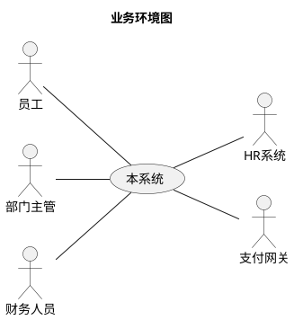
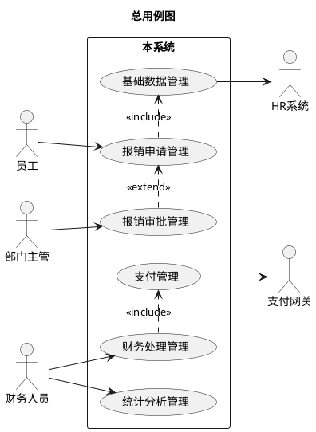
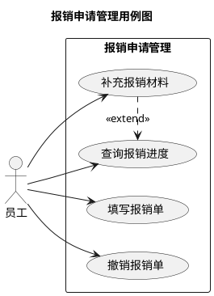
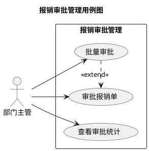

<!--使用说明
  1. 本文档是《软件需求规格说明书》模板。用于以下目的：
    a. 人类与AI智能体协作，作为软件产品经理，有效且高效地使用本模板为软件产品编制《软件需求规格说明书》的初始版本。
    b. 人类与AI智能体协作，作为产品经理，基于使用本模板编制的《软件需求规格说明书》的某个版本，有效且高效地编制《软件需求规格说明书》的下一版本。
    c. 产品经理、软件设计工程师、软件开发工程师、软件测试工程师（负责QC）、软件质量保证工程师（负责QA），无论承担这些角色的到底是人类还是AI智能体，还是二者的组合，有效且高效地评审基于本模板编制的《软件需求规格说明书》。
    d. 《软件需求规格说明书》要把软件产品的黑盒表面描述清楚，但不得描述软件产品的内部实现。
    e. 《软件需求规格说明书》要足以支撑后续的人类与AI智能体协作的软件概要设计、软件详细设计、软件测试方案和软件测试案例的编制。
  2. 《软件需求规格说明书》的编制，是一个不断迭代、更新的过程。
  3. 以软件产品为对象，而不是以软件研发项目为对象，编制《软件需求规格说明书》，以便软件产品的每个版本发布时，与其对应的《软件需求规格说明书》版本准确描述了该版本的软件产品的完整的需求规格。
  4. 要了解当前版本的《软件需求规格说明书》与上一版本的《软件需求规格说明书》的需求变化，应阅读《软件需求规格说明书》的“版本记录”章节，并使用版本比较工具。
-->

<!--请将下面的“<软件产品名称>”替换为准确的软件产品名称，一字不差。-->
# <软件产品名称>
# 软件需求规格说明书

## 版本记录
<!--这里是《软件需求规格说明书》的版本变更记录。
  版本号的编号规则为：<版本完成日期yyyymmdd>-<本文档当日完成序号>
-->
| 版本号| 修订内容 | 作者 |
|---|---|---|
| yyyymmdd-1 | 初版。 | 张三 |
| yyyymmdd-1 | 1. 新增需求……<br>2. 删除需求……<br>3. 修改需求…… | 李四 |

## 1. 系统概述
<!--用1-2段话说明系统的核心价值、主要用户、解决什么问题。-->
本系统是……

## 2. 业务环境
<!--
  1. 采用PlantUML的用例图，描述本系统所处的业务环境，即有哪些人类用户和外部系统在本系统之外且与本系统直接交互以实现业务。
  2. 将本系统识别为一个黑盒，表现为一个名为“本系统”的用例(Use Case)。
  3. 识别出所有直接与本软件产品交互的人类用户和外部系统，将它们表现为角色(Actors)。
  4. 不得出现与本系统不直接交互的人类用户或外部系统。
  5. 建立角色与本系统间的关联。
-->

<!--在下表中逐个说明上图中的人类用户和外部系统与本系统的业务往来。
  1. 人类用户的特征（例如，使用本系统的习惯、偏好等），可记入“备注”栏。
  2. 角色相关的信息如有参考文档，可记入“备注”栏。
-->
| 外部角色 | 类型 | 与本系统的业务往来 | 备注 |
|---|---|---|---|
| 员工 | 人类用户 | 1. 提交报销申请。<br>2. 查询报销进度。<br>3. 补充报销材料。 | 每月平均提交2-3次报销。 |
| 部门主管 | 人类用户 | 1. 审批下属报销单。<br>2. 查看部门费用统计。 | 偏好移动端审批。 |
| 财务人员 | 人类用户 | 1. 审核报销单据。<br>2. 发起支付。<br>3. 生成财务报表。 | 需要详细的审计日志。 |
| HR系统 | 外部系统 | 1. 同步员工组织架构。<br>2. 同步员工基本信息。 | 每日凌晨2点同步一次。 |
| 支付网关 | 外部系统 | 1. 接收支付指令。<br>2. 返回支付结果。 | 支持T+1到账。 |

## 3. 术语表
<!--在下表中定义本文中出现的可能产生歧义的术语。-->
| 术语 | 定义 | 备注 |
|---|---|---|
| 报销单 | 员工因公务消费发起，用于申请公司财务报销的电子凭证。 | 核心业务实体。 |
| 审批流 | 报销单需要经过的一系列审批节点和规则。 | 可配置。 |
| 支付批次 | 财务人员将多个报销单合并发起支付的集合。 | 提高支付效率。 |
| 费用类型 | 对报销费用进行的分类，如差旅费、办公费、招待费等。 | 与财务核算科目关联。 |
| SLA | 服务级别协议。本系统中特指与外部系统接口响应的最大延迟时间承诺。 | 参见接口协议文档。 |

## 4. 功能性需求
### 4.0. 总用例图
<!--
  1. 采用PlantUML的用例图，识别本系统的顶层用例包。这些顶层用例包将在后续章节拆分为更细的用例。
  2. 此图中的角色必须与业务环境图中的角色完全一致。
  3. 以用例包的形式，完整识别本系统的功能需求。
  4. 建立角色与用例包间的关联。
-->


<!--“4. 功能性需求”章中的其它章节，与总用例图中的各个用例包一一对应，且章节标题与对应的用例包的名字一字不差。-->
### 4.1. 报销申请管理
#### 4.1.0. 用例图
<!--
  1. 采用PlantUML的用例图，将总用例图中的一个用例包细化为一个用例图。
  2. 此图中的角色，与总用例图中与本用例包关联角色，完全相同。
  4. 建立角色与用例包间的关联。
-->


<!--本用例包的其它章节，与上图中的各个用例一一对应，且章节标题与对应的用例的名字一字不差。-->
#### 4.1.1. 填写报销单
<!--
  需求编号是下划线连接的3个字符串：<类别>_<分组>_<序号>
    <类别>：为“SF”（功能性需求）、“SQ”（非功能性需求）、“SR”（其它需求）中的一个。
    <分组>：
      - 对于功能性需求（<类别>为”SF“），按总用例图中的用例包分组，表现为从001-999的3位数字。
      - 对于非功能性需求（<类别>为”SQ“），细分小类作为分组，表现为2 - 3个汉字，详见本文非功能性需求章节中的示例。
      - 对于其它需求（<类别>为”SR“），总是取”其它“2字。
    <序号>：从001-999的3位数字。
  某个需求编号被分配给某个需求后，永不再分配给其它需求。
-->
**需求编号：** SF_001_001  
<!--需求优先级的评分规则请见本文尾部。-->
**优先级：** 4.3  
**参与者：** 员工  
**主要目标：** 员工成功创建并提交一份合规的报销申请。  
**前置条件：** 参与者已成功登录系统。

<!--
  1. 操作场景可以有多个；正常操作场景、异常操作场景应识别充分。
  2. 本系统与人类用户之间的交互，或在本文中文字描述，或在界面原型中展示界面；本系统与外部系统之间的交互，必须在本文中描述清楚。
  3. 操作场景描述中，与本系统交互的对象，必须恰是用例图中与本用例关联的角色，而不得“空降”其它交互对象，也不得出现与本用例关联的某个角色与本系统交互从未描述的现象。
  4. 以业务语言描述操作场景中的各步骤。
  5. 操作场景描述中，不应描述与本用例关联的角色的内部的操作(那与本系统无关)，也不应描述本系统内部是如何处理的(那是将来的概要设计、详细设计的内容)。
  6. 操作场景描述中，必须包含完整的业务规则说明。与用户界面密切相关的简单业务规则在用户界面快速原型中描述；复杂的业务规则在本文描述。
  7. 操作场景描述中，应在各步骤中标注关键的验收标准。
  8. 操作场景描述中，用到的在其它章节或参引文档也会用到的专用词汇(例如，接口名称、数据名称、界面元素名称……)，必须一字不差，以避免歧义或找不到。
  9. 用例描述应在1 - 2页纸内，且(从详细设计到修改完迭代内测试发现的Bug的)开发工作量不大于1人周。
-->
##### 主成功场景
1. 参与者选择菜单："报销" → "填写报销单"。
2. 系统显示"报销单填写"界面（参见附录-界面原型RP-001）。
3. 参与者填写以下必填信息：报销类型、日期、金额、发票附件，并点击"提交"按钮。
   *（验收：金额必须为大于0的数字，且带有两位小数。）*
4. 系统校验所有数据符合业务规则（见业务规则BR-001）。
   *（验收：若发票附件未上传，系统阻止提交并提示"请上传发票"。）*
5. 系统保存报销单，生成唯一报销单号`[REIM-YYYYMMDD-001]`，并清晰显示"提交成功"消息。
   *（验收：成功消息必须包含生成的报销单号。）*
6. 系统自动跳转至"我的报销单"列表页。

##### 扩展场景
*   **3a. 参与者点击"暂存"按钮：**
    1. 系统将当前填写内容保存为草稿。
    2. 系统提示"草稿已保存"。
*   **4a. 数据校验失败：**
    1. 系统在错误字段旁显示具体错误信息（如："报销日期不能晚于今天"）。
    2. 参与者修正错误后，可重新提交。

##### 业务规则
*   **BR-001（报销金额规则）：** 单笔报销金额不得超过10,000元人民币，单日累计报销不得超过50,000元人民币。
*   **BR-002（发票规则）：** 单张发票金额超过500元必须上传发票原件扫描件。

##### 特殊需求
*   支持从手机相册直接上传发票照片。
*   在提交成功后，系统应发送邮件通知给申请人。

#### 4.1.2. 查询报销进度
**需求编号：** SF_001_002  
**优先级：** 3.8  
**参与者：** 员工  
**主要目标：** 员工查看自己提交的报销单的当前处理状态和历史记录。  
**前置条件：** 参与者已成功登录系统。

##### 主成功场景
1. 参与者选择菜单："报销" → "我的报销单"。
2. 系统显示报销单列表，默认按提交时间倒序排列。
3. 参与者点击某条报销单记录。
4. 系统显示该报销单的详细信息，包括：当前状态、审批人、审批意见、处理时间线。
   *（验收：时间线必须按时间顺序清晰展示所有处理节点。）*

##### 业务规则
*   **BR-003（权限规则）：** 员工只能查看自己提交的报销单。

### 4.2. 报销审批管理
#### 4.2.0. 用例图



#### 4.2.1. 审批报销单
**需求编号：** SF_002_001  
**优先级：** 4.5  
**参与者：** 部门主管  
**主要目标：** 主管对下属提交的报销单进行审核并做出批准或拒绝的决定。  
**前置条件：** 
1. 参与者已成功登录系统。
2. 存在待本人审批的报销单。

##### 主成功场景
1. 系统在待办事项中提示有待审批报销单。
2. 参与者进入"待我审批"列表，选择一条报销单。
3. 系统展示报销单详情和所有附件。
4. 参与者点击"批准"按钮。
5. 系统弹出对话框要求填写审批意见（可选）。
6. 参与者点击"确认"。
   *（验收：系统必须记录审批人、审批时间、审批意见。）*
7. 系统更新报销单状态为"已批准"，并触发下一审批节点或进入财务处理流程。

##### 扩展场景
*   **4a. 参与者点击"拒绝"按钮：**
    1. 系统要求必须填写拒绝理由。
    2. 报销单状态变为"已拒绝"，流程终止，并通知申请人。

##### 业务规则
*   **BR-004（审批时限）：** 主管需在收到审批任务后48小时内处理。
*   **BR-005（金额权限）：** 不同级别主管有不同金额审批权限。

## 5. 非功能性需求
### 5.1. 标准与规范
<!--本系统需要遵循的标准与规范。例如：国际标准、国家标准、行业标准、企业标准等。-->
| 需求编号 | 优先级 | 标准与规范 | 备注 |
|---|---|---|---|
| SQ_标准_001 | 4.1 | 本系统对用户信息的收集、存储、使用、共享，必须满足GB/T 35273-2020《信息安全技术 个人信息安全规范》。 | 参考企业隐私政策v2.1 |
| SQ_标准_002 | 4.0 | 财务相关数据存储和传输需符合《企业会计准则》和《电子会计档案管理规范》。 | |

### 5.2. 运行环境
<!--本系统运行所需的软件、硬件、网络环境。-->
| 需求编号 | 优先级 | 名称 | 型号 | 关键参数 | 备注 |
|---|---|---|---|---|---|
| SQ_运行环境_001 | 4.0 | 应用服务器 | 物理服务器/云主机 | CPU：8核<br>内存：16GB<br>存储：500GB | 生产环境需要集群部署. |
| SQ_运行环境_002 | 4.0 | 数据库服务器 | 物理服务器 | CPU：16核<br>内存：32GB<br>存储：2TB | 主从复制，每天备份。 |
| SQ_运行环境_003 | 4.0 | 操作系统 | Ubuntu Server | 版本：22.04 LTS | |
| SQ_运行环境_004 | 4.0 | 浏览器 | Chrome | 版本110+ | 需支持移动端浏览器。 |

### 5.3. 接口
<!--描述本系统与外部系统之间的接口。
  1. 业务环境图中的每个外部系统，与本系统至少有1个接口。
  2. 如果相关接口已成文，应参引相关的接口文件。
-->
| 需求编号 | 优先级 | 接口名称 | 接口对方 | 接口描述 | 备注 |
|---|---|---|---|---|---|
| SQ_接口_001 | 4.8 | 获取员工信息 | HR系统 | 每日同步员工基本信息和组织架构。 | 接口协议参见HR-API-v3.docx。 |
| SQ_接口_002 | 4.5 | 发起支付 | 支付网关 | 批量发起报销款项支付。 | SLA：99.9%，响应时间<2s。 |
| SQ_接口_003 | 3.5 | 获取汇率 | 外部API | 获取实时外币汇率用于跨国报销计算。 | 免费版API，每日限1000次。 |

### 5.4. 安全
<!--例如，数据完整性、保密、可用性等。-->
| 需求编号 | 优先级 | 需求描述 | 备注 |
|---|---|---|---|
| SQ_安全_001 | 4.5 | 所有敏感数据传输必须使用TLS 1.3加密。 | |
| SQ_安全_002 | 4.2 | 保存用户所有关键操作日志，包括时间、IP、操作内容。 | 日志保留至少180天。|
| SQ_安全_003 | 4.0 | 支持多因素认证（MFA）登录。 | 可选功能，默认不开启。 |

### 5.5. 性能
<!--例如，并发数量、响应时间、峰值压力、存储容量等。-->
| 需求编号 | 优先级 | 需求描述 | 备注 |
|---|---|---|---|
| SQ_性能_001 | 4.0 | 普通页面加载时间不超过2秒。 | 在标准网络环境下测试。 |
| SQ_性能_002 | 3.8 | 支持500用户同时在线，100用户并发操作。 | 按公司规模预估。 |
| SQ_性能_003 | 3.5 | 月末报销高峰期系统响应时间延迟不超过20%。| |
| SQ_性能_004 | 3.0 | 报销单查询结果在3秒内返回。 | 即使数据量达到百万级。 |

### 5.6. 国际化
<!--例如，用户界面支持哪些语言、默认语言等。如果没有指定此类需求，默认为仅支持和显示简体中文。-->
| 需求编号 | 优先级 | 需求描述 | 备注 |
|---|---|---|---|
| SQ_国际化_001 | 2.2 | 支持中文、英文界面。 | 默认语言为中文。 |
| SQ_国际化_002 | 1.5 | 日期格式支持YYYY-MM-DD和MM/DD/YYYY。 | 根据用户浏览器语言设置自动切换。 |

## 6. 其它需求
<!--如果确实存在不便于在以上各章节中描述的需求，放在本章。-->
| 需求编号 | 优先级 | 需求描述 | 备注 |
|---|---|---|---|
| SR_其它_001 | 1.3 | 数据库管理系统要沿用客户现有的MySQL 8.0。 | 兼容现有DBA团队技能。 |
| SR_其它_002 | 2.0 | 提供完整的API文档供第三方系统集成使用。 | 使用OpenAPI 3.0规范。 |

## 7. 业务数据
<!--请将本系统涉及的业务数据统一汇总到下表中。这张表，既是对业务中的数据的梳理，又是将来的数据库设计的基础。-->
| 数据实体 | 描述 | 关键属性/字段 | 生命周期/保留期 | 备注 |
|---|---|---|---|---|
| 报销单 | 记录一次报销申请的核心实体。 | - 报销单号 (主键)<br>- 提交人<br>- 提交时间<br>- 报销类型<br>- 总金额<br>- 状态（草稿/已提交/已审批/已支付/已拒绝）<br>- 审批流ID<br>- 当前处理人 | 创建后保存至少7年。 | 状态变迁需记录完整日志。 |
| 员工信息 | 系统用户基础信息。 | - 员工ID (主键)<br>- 姓名<br>- 工号<br>- 部门<br>- 职位<br>- 邮箱<br>- 手机号 | 在职期间有效，离职后保留3年。 | 与HR系统同步，每日更新。 |
| 审批记录 | 记录报销单审批过程。 | - 记录ID<br>- 报销单号<br>- 审批人<br>- 审批时间<br>- 审批结果<br>- 审批意见 | 永久保存。 | 用于审计追踪。 |
| 支付记录 | 记录财务支付操作。 | - 支付ID<br>- 报销单号<br>- 支付批次号<br>- 支付金额<br>- 支付状态<br>- 支付时间 | 永久保存。 | 与支付网关交互记录。 |

## 8. 附录
<!--本系统的快速原型、与外部系统的接口协议、共性的业务规则/业务数据等可纳入附录。-->
### 8.1. 界面快速原型
- **RP-001：报销单填写界面**：包含表单布局、字段说明、验证规则。
- **RP-002：审批界面**：展示审批列表、详情查看、审批操作区域。
- **RP-003：财务处理界面**：支付批次创建、支付状态监控。

### 8.2. 接口协议文档
- **HR系统接口规范**：参见外部文档 `HR-API-v3.docx`。
- **支付网关接口规范**：参见外部文档 `Payment-Gateway-API-v2.1.pdf`。

### 8.3. 业务规则详述
- **BR-001 至 BR-005** 的完整描述和配置说明参见`公司报销流程.docx`。

<!--需求优先级评分规则如下：
  1. 需求优先级 = (业务价值 × 0.4) + (用户影响 × 0.3) + (技术风险 × 0.2) + (时间敏感性 × 0.1)

  2. 业务价值的刻画标准
    - 5分：直接关联核心业务目标，缺失会导致业务无法运行或重大损失。例如，支付功能、用户认证系统、符合GDPR的数据加密。
    - 4分：显著提升业务指标（如转化率、留存率），或支持高价值用户群体。例如，个性化推荐算法、企业级客户专属功能。
    - 3分：对业务有中等影响，但非关键路径。例如，用户反馈入口、基础报表功能。
    - 2分：边际效益有限，仅影响特定场景或小众用户。例如，第三方服务集成（非核心）、历史数据导出。
    - 1分：几乎无业务价值，或为技术债务清理/内部工具。例如，开发环境配置优化、内部测试账号管理。
  3. 用户影响的刻画标准
    - 5分：影响所有用户或核心用户群体，缺失会导致用户流失或投诉。例如，移动端适配、无障碍访问（如视障用户支持）。
    - 4分：影响高活跃用户或主要场景，对用户体验有显著提升。例如，搜索过滤功能、多设备同步。
    - 3分：影响部分用户或次要场景，用户可接受延迟实现。例如，批量操作功能、夜间模式。
    - 2分：影响少数用户或边缘场景，用户需求不强烈。例如，特定角色权限细分、自定义主题。
    - 1分：几乎不影响用户，或为内部功能。例如，服务器日志级别调整、代码注释优化。
  4. 技术风险的刻画标准
    - 5分：技术实现复杂度高，或依赖关键外部系统（如支付网关、政府接口）。例如，高并发处理、实时数据同步、与遗留系统集成。
    - 4分：技术挑战中等，或依赖内部其他模块（需协调多方资源）。例如，微服务架构改造、AI模型训练。
    - 3分：技术实现明确，但需一定开发周期。例如，基础CRUD功能、UI组件复用。
    - 2分：技术实现简单，无显著风险。例如，静态页面更新、配置项修改。
    - 1分：几乎无技术风险，或为现有功能扩展。例如，按钮颜色调整、帮助文档补充。
  5. 时间敏感性的刻画标准
    - 5分：法律/合规强制要求，或与核心业务事件强关联（如促销、财报）。例如，税收计算功能（财政年度变更前）、黑五促销页面。
    - 4分：	用户或市场强烈期待，延迟会导致竞争力下降。例如，竞争对手已上线功能、季度版本发布计划。
    - 3分：内部计划要求，但有一定灵活性。例如，迭代目标功能、跨部门协作里程碑。
    - 2分：可后续版本实现，无明确时间限制。例如，长期数据归档、性能优化。
    - 1分：无时间压力，或为技术债务清理。例如，代码重构、测试覆盖率提升。
-->

<!--下面是本模板的版本号，而不是《软件需求规格说明书》的版本号。使用本模板时，不得删除或更改。-->
```text
模板版本号：20260219-1
```
**全文结束**