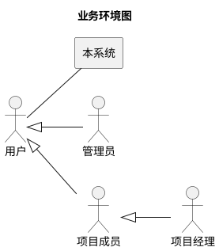
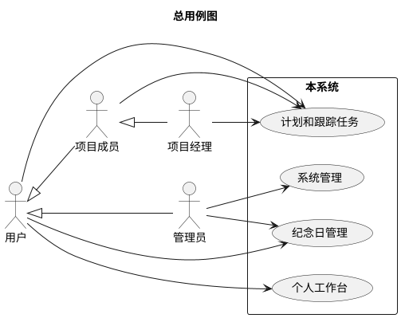
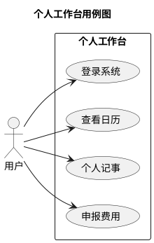
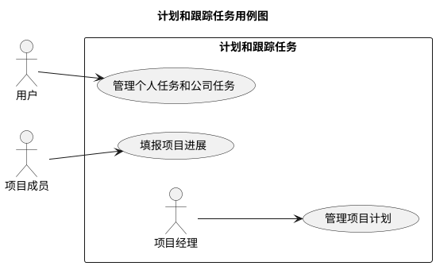
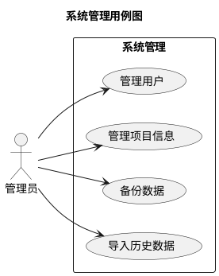
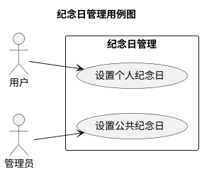

# 常精进线上记事本
# 软件需求规格说明书

## 版本记录
| 版本号| 修订内容 | 作者 |
|---|---|---|
| 20260611-1 | 初版。基于需求调研结果编制。 | product-manager agent |
| 20260614-2 | 根据评审意见全面修订。 | product-manager |
| 20260627-3 | 根据第二次评审意见修订。 | product-manager |
| 20260627-4 | 按角色分层重构功能结构。 | product-manager |
| 20260628-1 | 根据 v3 预审记录修订。 | product-manager |

## 1. 系统概述
本系统是一个基于web的个人和项目管理系统，旨在替代传统的Excel工作簿管理模式。用户可以通过任何支持浏览器的设备随时记录和查看信息，支持团队成员间的协作。系统核心功能包括个人记事、费用申报、项目计划管理、日历视图和纪念日管理。通过将分散在Excel中的信息整合到统一的web平台，实现信息的随时随地访问和团队协作。

## 2. 业务环境

| 外部角色 | 类型 | 与本系统的业务往来 | 备注 |
|---|---|---|---|
| 用户 | 人类用户 | 基础角色，可登录系统、查看日历、个人记事、申报费用、管理任务、管理纪念日 | 本系统不与外部系统直接交互，无外部接口需求 |
| 管理员 | 人类用户 | 特殊用户，可管理用户、管理项目信息、备份数据、导入历史数据 | 系统配置和数据管理 |
| 项目成员 | 人类用户 | 特殊用户，可参与项目任务、填报项目进展 | 团队成员，可参与项目任务 |
| 项目经理 | 人类用户 | 特殊项目成员，可管理项目计划 | 项目负责人，拥有项目计划管理权限 |

## 3. 术语表
| 术语 | 定义 | 备注 |
|---|---|---|
| 个人记事 | 用户可自定义结构的个人记录表 | 原佛学记录的扩展版本 |
| 费用归属 | 费用申报关联的项目 | 按项目全称关联 |
| 阶段 | 项目计划中的阶段划分 | 直接在计划管理中的"阶段"字段填写 |

## 4. 功能性需求
### 4.0. 总用例图

### 4.1. 个人工作台
#### 4.1.0. 用例图

#### 4.1.1. 登录系统
**需求编号：** SF_001_001  
**优先级：** 5.0  
**参与者：** 用户  
**主要目标：** 用户通过用户名和密码登录系统。  
**前置条件：** 无。

##### 主成功场景
1. 用户访问系统登录页面。
2. 系统显示登录表单，包含以下字段：
   - 用户名
   - 密码
3. 用户输入用户名和密码。
4. 用户点击"登录"按钮。
   *（验收：登录成功后跳转到主界面，显示"登录成功"消息。）*
5. 系统验证用户身份。
6. 系统进入仿Excel多标签页布局的主界面，默认显示上次访问的页签。

##### 异常场景
*   **4a. 用户名不存在或密码错误：**
    1. 系统显示"用户名或密码错误"消息。
    2. 用户重新输入。
*   **4b. 会话超时：**
    1. 系统跳转到登录页面。
    2. 系统显示"会话已过期，请重新登录"消息。

##### 业务规则
*   **BR-001（密码规则）：** 密码至少8位，包含大小写字母、数字和特殊字符。
*   **BR-002（会话管理）：** 登录后创建会话，超时时间30分钟。
*   **BR-003（登录策略）：** 不设重试次数限制、并发登录检查。

#### 4.1.2. 查看日历
**需求编号：** SF_001_002  
**优先级：** 5.0  
**参与者：** 用户  
**主要目标：** 用户查看月视图日历。  
**前置条件：** 用户已成功登录系统。

##### 主成功场景
1. 用户进入"查看日历"界面。
2. 系统显示日期选择器，允许指定查看某年某月。
3. 系统显示项目选择列表（不限长），用户可选择要显示的项目。
4. 系统显示人员选择列表（不限长），用户可选择要显示其任务和纪念日信息的人员。
5. 系统显示当前月的日历视图。
6. 日历显示：
   - 公历日期
   - 农历日期（六斋日可选项）
   - 当日任务（按权限显示）
   - 有权限查看的纪念日信息
7. 用户可以：
   - 切换到不同年月
   - 鼠标悬停显示任务详情（仅对有权限的任务）：资源名称（负责人）、计划开始日期、计划结束日期、计划工时、实际开始日期、实际结束日期、实际工时
   *（验收：在标准网络环境下，日历加载时间不超过3秒。）*

##### 业务规则
*   **BR-004（任务显示）：** 
   - 有权限的任务显示为"<项目简称>：任务名"
   - 无权限的任务显示为"其他项目事务"、"公司事务"、"个人事务"，用颜色区分三类
*   **BR-005（数据来源）：** 
   - 任务数据来源：项目计划、个人任务、公司任务
   - 纪念日数据来源：公共纪念日、个人纪念日

#### 4.1.3. 个人记事
**需求编号：** SF_002_001  
**优先级：** 4.7  
**参与者：** 用户  
**主要目标：** 用户记录和查看个人定制数据。  
**前置条件：** 用户已成功登录系统。

##### 主成功场景
1. 用户进入"个人记事"界面。
2. 系统显示数据录入界面，包含：
   - 统计信息区域（显示在数据上方）
   - 数据录入多行表格
3. 数据录入表格包含以下列：
   - 公历日期（必选，用户选择）
   - 农历日期（必选，基于公历自动计算不可编辑）
   - 自定义字段列（用户自定义）
4. 用户可以直接在表格中录入数据。
   *（验收：修改内容离开焦点后，页面显示保存状态指示器，刷新后数据不丢失。）*
5. 系统自动保存数据记录。

##### 扩展场景
*   **4a. 自定义字段：**
    1. 用户点击"自定义字段"按钮。
    2. 系统显示字段配置界面。
    3. 用户可以添加/修改/删除字段（仅指定字段名称，均为文本类型）。
    4. 系统更新字段配置。

##### 异常场景
*   **4b. 删除有数据的字段：**
    1. 用户点击字段列的删除按钮。
    2. 系统提示"删除字段将同时删除该字段的所有数据，是否继续？"
    3. 用户确认删除。
    4. 系统删除字段及相关数据。

##### 业务规则
*   **BR-006（必选字段）：** 公历日期和农历日期字段必须存在且不可删除。
*   **BR-007（字段数量限制）：** 最多支持50个自定义字段，字段名不能重复。
*   **BR-008（自动保存）：** 数据录入时自动保存，无需手动保存按钮。
*   **BR-009（统计功能）：** 可指定日期范围，统计次数、合计值、平均值。
*   **BR-010（特殊值规则）：** (0)应做未做，(1)应做且做了，(I)可不做但做了（补做）。
*   **BR-011（统计示例）：** 数据(0,1,1,I,1,"ABC",-2)的总次数=7，总和=2，均值=2/6。

#### 4.1.4. 申报费用
**需求编号：** SF_003_001  
**优先级：** 4.9  
**参与者：** 用户  
**主要目标：** 用户管理费用申报。  
**前置条件：** 用户已成功登录系统。

##### 主成功场景
1. 用户进入"申报费用"界面。
2. 系统显示费用申报多行表格，包含以下列：
   - 申报者（自动填充当前用户，不可修改）
   - 费用归属（选择存在的项目）
   - 担当人
   - 服务类型
   - 服务内容
   - 服务日期
   - 服务人天
   - 单价
   - 城际交通（工具/出发地/到达地/金额，单条记录）
   - 市内交通（工具/出发地/到达地/金额，单条记录）
   - 住宿费用
   - 其它费用
   - 操作（编辑/删除）
3. 用户可以直接在表格中添加、编辑、删除申报记录。
   *（验收：修改内容离开焦点后，页面显示保存状态指示器，刷新后数据不丢失。）*
4. 系统自动保存申报记录。

##### 扩展场景
*   **3a. 导出到Excel：**
    1. 用户点击"导出Excel"按钮。
    2. 系统生成Excel文件并下载。

##### 业务规则
*   **BR-012（金额规则）：** 无金额限制。
*   **BR-013（数据完整性）：** 用户保证数据完整性，系统不验证。
*   **BR-014（自动保存）：** 数据录入时自动保存，无需手动保存按钮。

### 4.2. 计划和跟踪任务
#### 4.2.0. 用例图

#### 4.2.1. 管理个人任务和公司任务
**需求编号：** SF_004_001  
**优先级：** 4.8  
**参与者：** 用户  
**主要目标：** 管理个人任务和公司任务。  
**前置条件：** 用户已成功登录系统。

##### 主成功场景
1. 用户进入"管理个人任务和公司任务"界面。
2. 系统显示任务多行表格，合并创建/编辑/查看/删除功能。
3. 表格包含以下列：
   - 任务类型（选择个人任务或公司任务）
   - 任务名称
   - 资源名称（默认当前用户，可从用户列表选择，允许手工编辑）
   - 计划开始/结束日期
   - 计划工时（单位人天）
   - 实际开始/结束日期
   - 实际工时（单位人天）
   - 操作（编辑/删除）
4. 用户可以直接在表格中添加、编辑、删除任务。
   *（验收：修改内容离开焦点后，页面显示保存状态指示器，刷新后数据不丢失。）*
5. 系统自动保存任务记录。

##### 业务规则
*   **BR-015（任务分类）：** 
   - 个人任务归属个人，仅自己可见
   - 公司任务所有成员可见
*   **BR-016（自动保存）：** 数据录入时自动保存，无需手动保存按钮。

#### 4.2.2. 管理项目计划
**需求编号：** SF_004_002  
**优先级：** 4.8  
**参与者：** 项目经理  
**主要目标：** 管理项目计划。  
**前置条件：** 项目经理已成功登录系统。

##### 主成功场景
1. 项目经理进入"管理项目计划"界面。
2. 系统显示完整项目层级结构：
   - 项目全称、简称
   - 阶段（在"阶段"字段中直接填写，text字段）
   - 各阶段下的任务
3. 系统按阶段汇总计划和实际的起止日期与工时，按项目汇总。
4. 项目经理可以直接在表格中添加、编辑、删除任务。
   *（验收：修改内容离开焦点后，页面显示保存状态指示器，刷新后数据不丢失。）*
5. 系统自动保存任务记录。

##### 业务规则
*   **BR-017（自动保存）：** 数据录入时自动保存，无需手动保存按钮。

#### 4.2.3. 填报项目进展
**需求编号：** SF_004_003  
**优先级：** 4.6  
**参与者：** 项目成员  
**主要目标：** 填报项目进展。  
**前置条件：** 项目成员已成功登录系统。

##### 主成功场景
1. 项目成员进入"填报项目进展"界面。
2. 系统显示完整项目计划，包含：
   - 项目全称、简称
   - 阶段、任务
   - 计划和实际数据
3. 项目成员仅可编辑自己负责的任务的实际数据（实际开始/结束日期、实际工时）。
4. 项目经理可编辑计划数据（计划开始/结束日期、计划工时）和所有实际数据。
5. 用户可以直接在表格中修改数据。
   *（验收：修改内容离开焦点后，页面显示保存状态指示器，刷新后数据不丢失。）*
6. 系统自动保存数据。

##### 扩展场景
*   **5a. 导出到Excel：**
    1. 用户点击"导出Excel"按钮。
    2. 系统生成完整项目计划的Excel文件并下载。

##### 业务规则
*   **BR-018（自动保存）：** 数据录入时自动保存，无需手动保存按钮。

### 4.3. 系统管理
#### 4.3.0. 用例图

#### 4.3.1. 管理用户
**需求编号：** SF_005_001  
**优先级：** 4.5  
**参与者：** 管理员  
**主要目标：** 管理系统用户。  
**前置条件：** 管理员已成功登录系统。

##### 主成功场景
1. 管理员进入"管理用户"界面。
2. 系统显示用户多行表格，合并添加/编辑/删除/设置密码功能。
3. 表格包含以下列：
   - 用户名（唯一，3-20字符，字母数字下划线）
   - 姓名
   - 邮箱
   - 状态（启用/禁用/已离职）
   - 操作（编辑/删除/设置密码）
4. 管理员可以直接在表格中添加、编辑、删除用户。
   *（验收：修改内容离开焦点后，页面显示保存状态指示器，刷新后数据不丢失。）*
5. 系统自动保存变更。

##### 扩展场景
*   **4a. 添加用户：**
    1. 管理员在表格中新增一行。
    2. 系统自动生成合规随机密码（避免混淆字符如1/l/O/0），允许管理员手工输入。
    3. 管理员填写用户信息。
    4. 系统验证信息有效性。
    5. 系统创建新用户账户。
*   **4b. 删除用户：**
    1. 管理员选择用户进行删除。
    2. 系统将用户状态设置为"已离职"，保留历史关联数据。

##### 业务规则
*   **BR-019（用户名规则）：** 用户名必须唯一，使用无业务含义的ID作为主键。
*   **BR-020（删除策略）：** 删除用户标记为"已离职"，保留历史关联数据。
*   **BR-021（自动保存）：** 数据修改后行级即时保存。

#### 4.3.2. 管理项目信息
**需求编号：** SF_005_002  
**优先级：** 4.8  
**参与者：** 管理员  
**主要目标：** 管理项目信息。  
**前置条件：** 管理员已成功登录系统。

##### 主成功场景
1. 管理员进入"管理项目信息"界面。
2. 系统显示项目多行表格，合并创建/编辑/删除功能。
3. 表格包含以下列：
   - 项目全称（唯一，最大100字符）
   - 项目简称
   - 项目经理（下拉选择用户）
   - 项目成员（多选下拉）
   - 项目状态（售前中/售前失败/运行中/暂停中/已关闭）
   - 操作（编辑/删除）
4. 管理员可以直接在表格中添加、编辑、删除项目。
   *（验收：修改内容离开焦点后，页面显示保存状态指示器，刷新后数据不丢失。）*
5. 系统自动保存变更。

##### 业务规则
*   **BR-022（项目全称唯一）：** 项目全称必须唯一，使用无业务含义的ID作为主键。
*   **BR-023（删除策略）：** 删除项目不连带删除关联的项目计划和费用申报记录。
*   **BR-024（自动保存）：** 数据修改后行级即时保存。

#### 4.3.3. 备份数据
**需求编号：** SF_005_003  
**优先级：** 4.0  
**参与者：** 管理员  
**主要目标：** 下载系统数据备份。  
**前置条件：** 管理员已成功登录系统。

##### 主成功场景
1. 管理员进入"备份数据"界面。
2. 系统显示备份管理界面。
3. 管理员点击"下载备份"按钮。
4. 系统开始创建备份，显示进度条。
   *（验收：备份包含所有用户数据、项目、任务、费用申报、个人记事、纪念日。）*
5. 备份完成后，系统自动下载备份文件。
6. 系统显示"仅备份，还原手工操作"提示。

##### 业务规则
*   **BR-025（备份内容）：** 备份文件包含所有用户数据、项目、任务、费用申报、个人记事、纪念日等数据实体的JSON数据文件。

#### 4.3.4. 导入历史数据
**需求编号：** SF_005_004  
**优先级：** 3.0  
**参与者：** 管理员  
**主要目标：** 导入历史Excel数据。  
**前置条件：** 管理员已成功登录系统。

##### 主成功场景
1. 管理员进入"导入历史数据"界面。
2. 系统显示文件上传界面。
3. 管理员选择CSV/Excel格式文件并上传。
4. 系统显示字段映射界面，让管理员确认导入数据与系统字段的对应关系。
5. 管理员确认映射关系后开始导入。
6. 系统校验数据格式，导入失败时提示具体错误行号和错误原因。
   *（验收：导入过程显示进度条，完成后显示成功/失败统计。）*
7. 系统显示导入结果。

##### 业务规则
*   **BR-026（导入格式）：** 支持CSV/Excel格式导入。
*   **BR-027（错误处理）：** 导入失败时提示具体错误行号和错误原因，提供重试选项。

### 4.4. 纪念日管理
#### 4.4.0. 用例图

#### 4.4.1. 设置公共纪念日
**需求编号：** SF_006_001  
**优先级：** 3.0  
**参与者：** 管理员  
**主要目标：** 管理员设置公共纪念日。  
**前置条件：** 管理员已成功登录系统。

##### 主成功场景
1. 管理员进入"设置公共纪念日"界面。
2. 系统显示纪念日管理多行表格，包含以下列：
   - 事件名称
   - 日期基准（公历/农历）
   - 日期
   - 备注
   - 操作（编辑/删除）
3. 管理员可以直接在表格中添加、编辑、删除公共纪念日。
   *（验收：修改内容离开焦点后，页面显示保存状态指示器，刷新后数据不丢失。）*
4. 系统自动保存纪念日记录。

##### 业务规则
*   **BR-028（日期规则）：** 支持按公历/农历日期设置，以年为周期；闰年2月29日仅在闰年有效；农历闰月按农历历法处理。
*   **BR-029（自动保存）：** 数据录入时自动保存，无需手动保存按钮。

#### 4.4.2. 设置个人纪念日
**需求编号：** SF_006_002  
**优先级：** 3.2  
**参与者：** 用户  
**主要目标：** 用户设置个人纪念日。  
**前置条件：** 用户已成功登录系统。

##### 主成功场景
1. 用户进入"设置个人纪念日"界面。
2. 系统显示纪念日管理多行表格，包含以下列：
   - 事件名称
   - 日期基准（公历/农历）
   - 日期
   - 备注
   - 操作（编辑/删除）
3. 用户可以直接在表格中添加、编辑、删除个人纪念日。
   *（验收：修改内容离开焦点后，页面显示保存状态指示器，刷新后数据不丢失。）*
4. 系统自动保存纪念日记录。

##### 业务规则
*   **BR-030（日期规则）：** 支持按公历/农历日期设置，以年为周期；闰年2月29日仅在闰年有效；农历闰月按农历历法处理。
*   **BR-031（自动保存）：** 数据录入时自动保存，无需手动保存按钮。

## 5. 非功能性需求
### 5.1. 标准与规范
| 需求编号 | 优先级 | 标准与规范 | 备注 |
|---|---|---|---|
| SQ_标准_001 | 2.0 | 符合国家相关技术标准 | 具体标准在设计阶段确定 |

### 5.2. 运行环境
| 需求编号 | 优先级 | 名称 | 型号 | 关键参数 | 备注 |
|---|---|---|---|---|---|
| SQ_运行环境_001 | 4.0 | Web服务器 | 用户期望 | 支持免费服务器部署 | 如GitHub Pages、Cloudflare Pages等 |
| SQ_运行环境_002 | 4.0 | 数据库 | 用户期望 | 轻量级，适合免费环境 | 技术选型在设计阶段确定 |
| SQ_运行环境_003 | 4.0 | 操作系统 | 用户期望 | 兼容主流免费服务器 | 技术选型在设计阶段确定 |
| SQ_运行环境_004 | 3.5 | 浏览器 | 用户期望 | Chrome 90+、Firefox 88+、Safari 14+ | |

### 5.3. 接口
无。本系统为独立运行的个人和项目管理系统，不与外部系统直接交互，无外部接口需求。

### 5.4. 安全
| 需求编号 | 优先级 | 需求描述 | 备注 |
|---|---|---|---|
| SQ_安全_001 | 4.8 | 用户密码必须使用bcrypt哈希存储 | 密码重置功能需验证邮箱 |
| SQ_安全_002 | 4.0 | 系统需有基本的防SQL注入措施 | 使用参数化查询 |
| SQ_安全_003 | 4.0 | 系统应具备基本的Web安全防护能力 | 具体测试方案在测试阶段细化 |
| SQ_安全_004 | 3.5 | 管理员操作需记录日志 | 操作人、操作时间、操作类型、操作对象，存储至少180天 |

### 5.5. 性能
| 需求编号 | 优先级 | 需求描述 | 备注 |
|---|---|---|---|
| SQ_性能_001 | 4.5 | 系统响应时间在标准网络环境下不超过3秒 | 标准网络环境：带宽≥10Mbps，RTT≤50ms |
| SQ_性能_002 | 4.5 | 日历页面加载时间不超过3秒 | 在标准网络环境下测试（带宽≥10Mbps，RTT≤50ms） |
| SQ_性能_003 | 4.0 | 支持50个用户同时在线 | 按团队规模预估 |

### 5.6. 国际化
| 需求编号 | 优先级 | 需求描述 | 备注 |
|---|---|---|---|
| SQ_国际化_001 | 2.0 | 系统界面仅支持中文 | |
| SQ_国际化_002 | 1.5 | 日期格式支持YYYY-MM-DD | |

## 6. 其它需求
| 需求编号 | 优先级 | 需求描述 | 备注 |
|---|---|---|---|
| SR_其它_002 | 2.5 | 系统应考虑中国大陆网络环境 | 优化CDN和资源加载 |
| SR_其它_003 | 2.0 | 系统应提供基本的错误提示 | 友好的用户界面提示 |

## 7. 业务数据
| 数据实体 | 描述 | 关键属性/字段 | 数据类型/长度 | 生命周期/保留期 | 备注 |
|---|---|---|---|---|---|
| 用户 | 系统用户账户 | - 用户ID (主键，自增ID) - 用户名 (varchar(20)) - 密码哈希 - 姓名 (varchar(50)) - 邮箱 (varchar(100)) - 角色（用户/管理员） - 状态（启用/禁用/已离职） | 永久保存 | 用户名唯一，使用无业务含义的ID作为主键 |
| 项目 | 项目信息 | - 项目ID (主键，自增ID) - 项目全称 (varchar(100)) - 项目简称 (varchar(100)) - 项目经理 - 项目成员 - 项目状态 - 创建时间 | 永久保存 | 项目全称唯一，使用无业务含义的ID作为主键 |
| 任务 | 项目任务 | - 任务ID (主键，自增ID) - 项目ID - 任务名称 (varchar(100)) - 任务类型（个人任务/公司任务） - 资源ID - 阶段 (varchar(50)) - 计划开始日期 - 计划结束日期 - 计划工时 - 实际开始日期 - 实际结束日期 - 实际工时 - 备注 (varchar(500)) | 永久保存 | |
| 费用申报 | 费用申报记录 | - 申报ID (主键，自增ID) - 申报者ID - 费用归属 - 担当人 - 服务类型 - 服务内容 - 服务日期 - 服务人天 - 单价 - 城际交通（工具/出发地/到达地/金额） - 市内交通（工具/出发地/到达地/金额） - 住宿费用 - 其它费用 - 创建时间 | 永久保存 | |
| 个人记事 | 个人定制记录 | - 记录ID (主键，自增ID) - 用户ID - 公历日期 - 农历日期 - 自定义字段值 - 创建时间 | 永久保存 | 字段结构可自定义 |
| 公共纪念日 | 公共纪念日记录 | - 纪念日ID (主键，自增ID) - 事件名称 (varchar(100)) - 日期基准（公历/农历） - 日期 - 备注 (varchar(500)) | 永久保存 | 所有团队成员可见 |
| 个人纪念日 | 个人纪念日记录 | - 纪念日ID (主键，自增ID) - 用户ID - 事件名称 (varchar(100)) - 日期基准（公历/农历） - 日期 - 备注 (varchar(500)) | 永久保存 | 仅自己可见 |

## 8. 附录
### 8.1. 界面快速原型
- **RP-001：登录界面**：用户名和密码输入框，登录按钮，错误提示
- **RP-002：个人工作台主界面**：仿Excel多标签页布局，默认显示上次访问的页签
- **RP-003：查看日历界面**：日期选择器 + 项目选择列表 + 人员选择列表 + 月视图日历，显示任务和纪念日
- **RP-004：个人记事界面**：统计信息区域 + 数据录入多行表格，支持自定义字段
- **RP-005：申报费用界面**：多行表格显示申报记录，支持行内编辑，保存状态指示器
- **RP-006：管理个人任务和公司任务界面**：任务类型选择 + 多行表格显示任务，支持行内编辑，保存状态指示器
- **RP-007：管理项目计划界面**：项目基本信息 + 多行表格显示项目计划，支持行内编辑，保存状态指示器
- **RP-008：填报项目进展界面**：完整项目计划显示，支持行内编辑，保存状态指示器
- **RP-009：管理用户界面**：多行表格显示用户信息，包含状态字段，支持行内编辑，保存状态指示器
- **RP-010：管理项目信息界面**：多行表格显示项目信息，支持行内编辑，保存状态指示器
- **RP-011：备份数据界面**：备份管理界面，下载备份按钮
- **RP-012：导入历史数据界面**：文件上传界面，字段映射界面
- **RP-013：设置公共纪念日界面**：多行表格显示公共纪念日，支持行内编辑，保存状态指示器
- **RP-014：设置个人纪念日界面**：多行表格显示个人纪念日，支持行内编辑，保存状态指示器

### 8.2. 接口协议文档
无

### 8.3. 业务规则详述
- **BR-001至BR-031** 的完整描述和配置说明详见各章节。

模板版本号：20260219-1