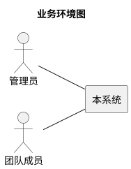
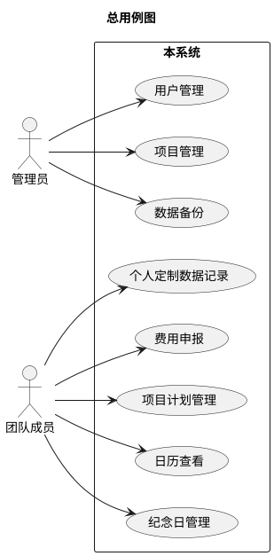
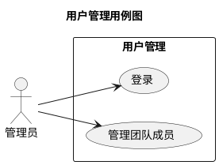
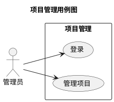
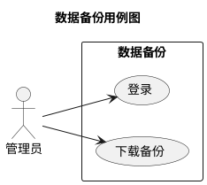
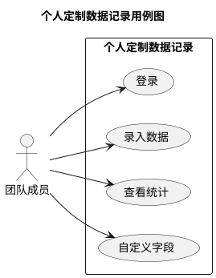
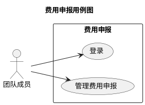
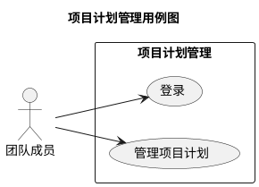
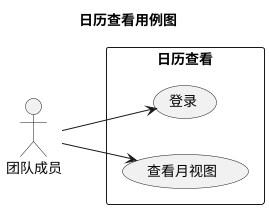
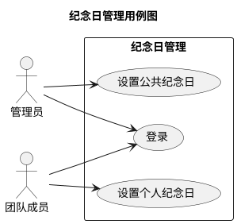

# ocagents
# 软件需求规格说明书

## 版本记录
| 版本号| 修订内容 | 作者 |
|---|---|---|
| 20260611-1 | 初版。基于需求调研结果编制。 | product-manager agent |
| 20260614-2 | 根据评审意见全面修订。 | product-manager |
| 20260627-3 | 根据第二次评审意见修订。 | product-manager |

## 1. 系统概述
本系统是一个基于web的个人和项目管理系统，旨在替代传统的Excel工作簿管理模式。用户可以通过任何支持浏览器的设备随时记录和查看信息，支持团队成员间的协作。系统核心功能包括个人定制数据记录、费用申报、项目计划管理、日历视图和纪念日管理。通过将分散在Excel中的信息整合到统一的web平台，实现信息的随时随地访问和团队协作。

## 2. 业务环境

| 外部角色 | 类型 | 与本系统的业务往来 | 备注 |
|---|---|---|---|
| 管理员 | 人类用户 | 管理团队成员、管理项目、下载备份 | 系统配置和数据管理 |
| 团队成员 | 人类用户 | 记录个人定制数据、填写费用申报、管理个人任务计划、查看日历和任务 | 主要功能使用者 |

## 3. 术语表
| 术语 | 定义 | 备注 |
|---|---|---|
| 资源名称 | 团队成员的标识，与可登录的用户保持一致 | 任务计划中的执行人 |
| 项目全称 | 项目的完整名称，用于费用申报关联 | 必须唯一，最大长度100字符 |
| 项目简称 | 项目的简称，用于日历中显示 | 如"铁越2025" |
| 个人定制数据记录 | 用户可自定义结构的个人记录表 | 原佛学记录的扩展版本 |
| 阶段 | 项目计划中的阶段划分 | 直接在计划管理中的"阶段"字段填写 |

## 4. 功能性需求
### 4.0. 总用例图

### 4.1. 用户管理
#### 4.1.0. 用例图

#### 4.1.1. 登录
**需求编号：** SF_001_001  
**优先级：** 5.0  
**参与者：** 管理员、团队成员  
**主要目标：** 用户登录系统。  
**前置条件：** 无。

##### 主成功场景
1. 用户访问系统登录页面。
2. 系统显示登录表单，包含以下字段：
   - 用户名
   - 密码
3. 用户输入用户名和密码。
4. 用户点击"登录"按钮。
   *（验收：登录成功后跳转到主界面，显示"登录成功"消息。）*
5. 系统验证用户身份。
6. 系统根据用户角色跳转到相应界面。

##### 异常场景
*   **4a. 用户名不存在或密码错误：**
    1. 系统显示"用户名或密码错误"消息。
    2. 用户重新输入。
*   **4b. 会话超时：**
    1. 系统跳转到登录页面。
    2. 系统显示"会话已过期，请重新登录"消息。

##### 业务规则
*   **BR-001（密码安全）：** 密码必须使用bcrypt哈希算法存储。
*   **BR-002（会话管理）：** 登录后创建会话，超时时间30分钟。
*   **BR-003（密码规则）：** 密码长度8-20位，必须包含大小写字母、数字和特殊字符，允许的特殊字符为!@#$%^&*()_-+=[]{}|;:,.<>?。

#### 4.1.2. 管理团队成员
**需求编号：** SF_001_002  
**优先级：** 4.5  
**参与者：** 管理员  
**主要目标：** 管理员管理团队成员信息。  
**前置条件：** 管理员已成功登录系统。

##### 主成功场景
1. 管理员进入"管理团队成员"界面。
2. 系统显示团队成员多行表格，包含以下列：
   - 用户名
   - 姓名
   - 邮箱
   - 角色
   - 状态（启用/禁用）
3. 管理员可以直接在表格中添加、编辑、删除成员信息。
   *（验收：修改内容离开焦点后，页面显示保存状态指示器，刷新后数据不丢失。）*
4. 系统自动保存变更。

##### 扩展场景
*   **3a. 添加成员：**
    1. 管理员在表格中新增一行。
    2. 系统自动生成合规随机密码（保证每次不同，避免混淆字符）。
    3. 管理员填写成员信息。
    4. 系统验证信息有效性（用户名3-20字符，字母数字下划线）。
    5. 系统创建新用户账户。

##### 业务规则
*   **BR-004（用户名唯一）：** 用户名必须唯一，使用无业务含义的ID作为主键。
*   **BR-005（删除策略）：** 删除成员时标记为"已离职"，保留该成员的历史关联数据。
*   **BR-006（自动保存）：** 数据修改后行级即时保存。

### 4.2. 项目管理
#### 4.2.0. 用例图

#### 4.2.1. 管理项目
**需求编号：** SF_002_001  
**优先级：** 4.8  
**参与者：** 管理员  
**主要目标：** 管理员管理项目信息。  
**前置条件：** 管理员已成功登录系统。

##### 主成功场景
1. 管理员进入"管理项目"界面。
2. 系统显示项目多行表格，包含以下列：
   - 项目全称
   - 项目简称
   - 项目负责人
   - 项目成员
   - 项目状态
   - 操作（编辑/删除）
3. 管理员可以直接在表格中添加、编辑、删除项目信息。
   *（验收：修改内容离开焦点后，页面显示保存状态指示器，刷新后数据不丢失。）*
4. 系统自动保存变更。

##### 扩展场景
*   **3a. 添加项目：**
    1. 管理员在表格中新增一行。
    2. 管理员填写项目信息，包括：
       - 项目全称（必填，唯一，最大100字符）
       - 项目简称
       - 项目负责人（必须是项目成员之一）
       - 项目成员
       - 项目状态（售前中/售前失败/运行中/暂停中/已关闭）
    3. 管理员确认添加。

##### 业务规则
*   **BR-007（项目全称唯一）：** 项目全称必须唯一，使用无业务含义的ID作为主键。
*   **BR-008（项目负责人）：** 项目负责人必须是项目成员之一。
*   **BR-009（项目全称修改）：** 项目全称修改后不影响已有费用申报的关联（按项目唯一标识关联）。
*   **BR-010（自动保存）：** 数据修改后行级即时保存。

### 4.3. 数据备份
#### 4.3.0. 用例图

#### 4.3.1. 下载备份
**需求编号：** SF_003_001  
**优先级：** 4.0  
**参与者：** 管理员  
**主要目标：** 管理员下载系统数据备份。  
**前置条件：** 管理员已成功登录系统。

##### 主成功场景
1. 管理员进入"下载备份"界面。
2. 系统显示备份管理界面。
3. 管理员点击"下载备份"按钮。
4. 系统开始创建备份，显示进度条。
   *（验收：备份包含所有用户数据、项目配置、任务记录等。）*
5. 备份完成后，系统自动下载备份文件。

##### 业务规则
*   **BR-011（备份内容）：** 备份文件为ZIP格式，包含用户、项目、项目成员、任务、费用申报、个人定制数据、纪念日等数据实体的JSON数据文件。
*   **BR-012（备份说明）：** 仅备份，还原手工操作。

### 4.4. 个人定制数据记录
#### 4.4.0. 用例图

#### 4.4.1. 录入数据
**需求编号：** SF_004_001  
**优先级：** 4.7  
**参与者：** 团队成员  
**主要目标：** 用户记录和查看个人定制数据。  
**前置条件：** 团队成员已成功登录系统。

##### 主成功场景
1. 团队成员进入"个人定制数据记录"界面。
2. 系统显示数据录入界面，包含：
   - 统计信息区域（显示在数据上方）
   - 数据录入多行表格
3. 数据录入表格包含以下列：
   - 公历日期（必填，用户选择，系统自动计算并填充农历日期）
   - 农历日期（必填，不可编辑）
   - 自定义字段列（用户自定义）
4. 团队成员可以直接在表格中录入数据。
   *（验收：修改内容离开焦点后，页面显示保存状态指示器，刷新后数据不丢失。）*
5. 系统自动保存数据记录。

##### 扩展场景
*   **4a. 删除自定义字段：**
    1. 团队成员点击字段列的删除按钮。
    2. 系统提示"删除字段将同时删除该字段的所有数据，是否继续？"
    3. 团队成员确认删除。
    4. 系统删除字段及相关数据。

##### 异常场景
*   **4b. 无效日期：**
    1. 系统提示"日期无效"。
    2. 用户修正日期。
*   **4c. 字段输入不合规：**
    1. 系统提示具体错误信息。
    2. 用户修正输入。

##### 业务规则
*   **BR-013（必选字段）：** 公历日期和农历日期字段必须存在且不可删除。
*   **BR-014（字段数量限制）：** 最多支持50个自定义字段，字段名不能重复，字段名长度限制50字符。
*   **BR-015（自动保存）：** 数据录入时自动保存，无需手动保存按钮。
*   **BR-016（特殊值处理）：** 字段类型全部为文本。统计时：(0)表示应做未做，(1)表示应做且做了，(I)表示可不做但做了（补做），其它值表示可不做且未做或文字记事。总次数=所有非空行数，总和=可转为数字的值或符合特殊规则的值之和（I视为1），均值=总和/(总次数-不计入统计的非数字行数)。

#### 4.4.2. 查看统计
**需求编号：** SF_004_002  
**优先级：** 3.8  
**参与者：** 团队成员  
**主要目标：** 用户查看个人定制数据的统计分析。  
**前置条件：** 团队成员已成功登录系统，已有数据记录。

##### 主成功场景
1. 团队成员在"个人定制数据记录"界面。
2. 系统在数据上方显示统计信息区域。
3. 系统显示统计配置选项：
   - 开始日期选择器
   - 结束日期选择器
4. 团队成员选择统计时间范围（日期范围无上限）。
5. 系统实时显示统计结果：
   - 总次数（内容非空即计1次）
   - 合计值（对数值加总）
   - 平均值（求数值的平均值）
   *（验收：统计结果实时更新，修改数据后立即重新计算。）*

### 4.5. 费用申报
#### 4.5.0. 用例图

#### 4.5.1. 管理费用申报
**需求编号：** SF_005_001  
**优先级：** 4.9  
**参与者：** 团队成员  
**主要目标：** 用户管理费用申报。  
**前置条件：** 团队成员已成功登录系统。

##### 主成功场景
1. 团队成员进入"费用申报"界面。
2. 系统显示费用申报多行表格，包含以下列：
   - 申报者（自动填充当前用户，不可修改）
   - 费用归属
   - 担当人
   - 服务类型
   - 服务内容
   - 服务日期
   - 服务人天
   - 单价
   - 城际交通（工具/出发地/到达地/金额）
   - 市内交通（工具/出发地/到达地/金额）
   - 住宿费用
   - 其它费用
   - 操作（编辑/删除）
3. 团队成员可以直接在表格中添加、编辑、删除申报记录。
   *（验收：修改内容离开焦点后，页面显示保存状态指示器，刷新后数据不丢失。）*
4. 系统自动保存申报记录。

##### 业务规则
*   **BR-017（金额规则）：** 所有金额字段≥0，小数点后两位。
*   **BR-018（项目关联）：** 费用归属必须关联存在的项目，按项目全称关联。
*   **BR-019（项目删除）：** 项目删除后已有申报保留。
*   **BR-020（自动保存）：** 数据录入时自动保存，无需手动保存按钮。

### 4.6. 项目计划管理
#### 4.6.0. 用例图

#### 4.6.1. 管理项目计划
**需求编号：** SF_006_001  
**优先级：** 4.8  
**参与者：** 团队成员  
**主要目标：** 用户管理项目计划。  
**前置条件：** 团队成员已成功登录系统。

##### 主成功场景
1. 团队成员进入"项目计划管理"界面。
2. 系统在页面上方显示项目基本信息（项目全称、项目简称）。
3. 系统显示项目计划多行表格，包含以下列：
   - 阶段名称（直接在表格中填写）
   - 任务名称
   - 资源名称（下拉选择本项目成员）
   - 计划开始日期
   - 计划结束日期
   - 计划工时（单位：人天）
   - 实际开始日期
   - 实际结束日期
   - 实际工时（单位：人天）
   - 备注
   - 操作（编辑/删除）
4. 团队成员可以直接在表格中添加、编辑、删除任务。
   *（验收：修改内容离开焦点后，页面显示保存状态指示器，刷新后数据不丢失。）*
5. 系统自动保存任务记录。

##### 业务规则
*   **BR-021（日期逻辑）：** 计划开始日期不能晚于计划结束日期。
*   **BR-022（权限规则）：**
    - 普通成员仅可编辑自己负责的任务的实际数据（实际开始日期、实际结束日期、实际工时）
    - 项目负责人可编辑计划数据（计划开始/结束日期、计划工时）和所有实际数据
*   **BR-023（自动保存）：** 数据录入时自动保存，无需手动保存按钮。

### 4.7. 日历查看
#### 4.7.0. 用例图

#### 4.7.1. 查看月视图
**需求编号：** SF_007_001  
**优先级：** 5.0  
**参与者：** 团队成员  
**主要目标：** 用户查看月视图日历。  
**前置条件：** 团队成员已成功登录系统。

##### 主成功场景
1. 团队成员进入"日历查看"界面。
2. 系统显示日期选择器，允许指定查看某年某月。
3. 系统显示选定月的日历视图。
4. 日历显示：
   - 公历日期
   - 农历日期
   - 当日任务（按权限显示）
   - 有权限的纪念日信息
5. 团队成员可以：
   - 切换到不同年月
   - 查看任务详情（hover显示：任务名称、起止日期、负责人）
   *（验收：在标准网络环境下（带宽≥10Mbps，RTT≤50ms），日历加载时间不超过3秒。）*

##### 业务规则
*   **BR-024（任务显示）：** 
    - 有权限的任务显示为"<项目简称>：任务名"
    - 无权限的任务分为三类：
      - 其他项目事务=非本人参与的项目任务
      - 公司事务=公司任务模块中的本人不参与的任务
      - 个人事务=个人任务模块中他人的任务
    - 三类无权限任务使用不同颜色区分
*   **BR-025（纪念日显示）：** 
    - 有权限的纪念日显示事件描述
    - 无权限的纪念日不显示
    - 纪念日使用特殊背景色

### 4.8. 纪念日管理
#### 4.8.0. 用例图

#### 4.8.1. 设置公共纪念日
**需求编号：** SF_008_001  
**优先级：** 3.0  
**参与者：** 管理员  
**主要目标：** 管理员设置公共纪念日。  
**前置条件：** 管理员已成功登录系统。

##### 主成功场景
1. 管理员进入"设置公共纪念日"界面。
2. 系统显示纪念日管理多行表格，包含以下列：
   - 事件名称
   - 日期基准（公历/农历）
   - 日期
   - 备注
   - 操作（编辑/删除）
3. 管理员可以直接在表格中添加、编辑、删除公共纪念日。
   *（验收：修改内容离开焦点后，页面显示保存状态指示器，刷新后数据不丢失；纪念日修改后日历视图应在合理时间内更新显示。）*
4. 系统自动保存纪念日记录。

##### 业务规则
*   **BR-026（日期验证）：** 公历2月29日仅在闰年有效；农历闰月按农历历法处理；日期基准切换时不做自动转换。
*   **BR-027（自动保存）：** 数据录入时自动保存，无需手动保存按钮。

#### 4.8.2. 设置个人纪念日
**需求编号：** SF_008_002  
**优先级：** 3.2  
**参与者：** 团队成员  
**主要目标：** 用户设置个人纪念日。  
**前置条件：** 团队成员已成功登录系统。

##### 主成功场景
1. 团队成员进入"设置个人纪念日"界面。
2. 系统显示纪念日管理多行表格，包含以下列：
   - 事件名称
   - 日期基准（公历/农历）
   - 日期
   - 备注
   - 操作（编辑/删除）
3. 团队成员可以直接在表格中添加、编辑、删除个人纪念日。
   *（验收：修改内容离开焦点后，页面显示保存状态指示器，刷新后数据不丢失；纪念日修改后日历视图应在合理时间内更新显示。）*
4. 系统自动保存纪念日记录。

##### 业务规则
*   **BR-028（日期验证）：** 公历2月29日仅在闰年有效；农历闰月按农历历法处理；日期基准切换时不做自动转换。
*   **BR-029（自动保存）：** 数据录入时自动保存，无需手动保存按钮。

## 5. 非功能性需求
### 5.1. 标准与规范
| 需求编号 | 优先级 | 标准与规范 | 备注 |
|---|---|---|---|
| SQ_标准_001 | 2.0 | 系统响应时间在标准网络环境下不超过3秒 | 标准网络环境：带宽≥10Mbps，RTT≤50ms |

### 5.2. 运行环境
| 需求编号 | 优先级 | 名称 | 型号 | 关键参数 | 备注 |
|---|---|---|---|---|---|
| SQ_运行环境_001 | 4.0 | Web服务器 | 用户期望 | 支持免费服务器部署 | 如GitHub Pages、Cloudflare Pages等 |
| SQ_运行环境_002 | 4.0 | 数据库 | 用户期望 | 轻量级，适合免费环境 | 技术选型在设计阶段确定 |
| SQ_运行环境_003 | 4.0 | 操作系统 | 用户期望 | 兼容主流免费服务器 | 技术选型在设计阶段确定 |
| SQ_运行环境_004 | 3.5 | 浏览器 | 用户期望 | Chrome 90+、Firefox 88+、Safari 14+ | |

### 5.3. 接口
无。本系统为独立运行的个人和项目管理系统，不与外部系统直接交互，无外部接口需求。

### 5.4. 安全
| 需求编号 | 优先级 | 需求描述 | 备注 |
|---|---|---|---|
| SQ_安全_001 | 4.8 | 用户密码必须使用bcrypt哈希存储 | 密码重置功能需验证邮箱 |
| SQ_安全_002 | 4.0 | 系统需有基本的防SQL注入措施 | 使用参数化查询 |
| SQ_安全_003 | 4.0 | 系统应具备基本的Web安全防护能力 | 具体测试方案在测试阶段细化 |
| SQ_安全_004 | 3.5 | 管理员操作需记录日志 | 操作人、操作时间、操作类型、操作对象，存储至少180天 |

### 5.5. 性能
| 需求编号 | 优先级 | 需求描述 | 备注 |
|---|---|---|---|
| SQ_性能_001 | 4.5 | 日历页面加载时间不超过3秒 | 在标准网络环境下测试（带宽≥10Mbps，RTT≤50ms） |
| SQ_性能_002 | 4.0 | 支持50个用户同时在线 | 按团队规模预估 |

### 5.6. 国际化
| 需求编号 | 优先级 | 需求描述 | 备注 |
|---|---|---|---|
| SQ_国际化_001 | 2.0 | 系统界面仅支持中文 | |
| SQ_国际化_002 | 1.5 | 日期格式支持YYYY-MM-DD | |

## 6. 其它需求
| 需求编号 | 优先级 | 需求描述 | 备注 |
|---|---|---|---|
| SR_其它_001 | 3.0 | 系统应支持免费服务器部署 | 如GitHub Pages、Cloudflare Pages等 |
| SR_其它_002 | 2.5 | 系统应考虑中国大陆网络环境 | 优化CDN和资源加载 |
| SR_其它_003 | 2.0 | 系统应提供基本的错误提示 | 友好的用户界面提示 |
| SR_其它_004 | 3.0 | 支持数据导入功能 | 支持CSV/Excel格式，页面上传方式，导入时校验数据格式，导入失败提示具体错误行 |

## 7. 业务数据
| 数据实体 | 描述 | 关键属性/字段 | 数据类型/长度 | 生命周期/保留期 | 备注 |
|---|---|---|---|---|---|
| 用户 | 系统用户账户 | - 用户ID (主键，自增ID) - 用户名 (varchar(20)) - 密码哈希 - 姓名 (varchar(50)) - 邮箱 (varchar(100)) - 角色（管理员/成员） - 状态（启用/禁用） | 永久保存 | 用户名唯一，使用无业务含义的ID作为主键 |
| 项目 | 项目信息 | - 项目ID (主键，自增ID) - 项目全称 (varchar(100)) - 项目简称 (varchar(100)) - 项目负责人 - 项目成员 - 项目状态 - 创建时间 | 永久保存 | 项目全称唯一，使用无业务含义的ID作为主键 |
| 阶段 | 项目阶段 | - 阶段ID (主键，自增ID) - 项目ID - 阶段名称 (varchar(50)) - 开始日期 - 结束日期 | 项目存在期间有效 | 任务隶属于阶段 |
| 任务 | 项目任务 | - 任务ID (主键，自增ID) - 阶段ID - 任务名称 (varchar(100)) - 资源ID - 计划开始日期 - 计划结束日期 - 计划工时 - 实际开始日期 - 实际结束日期 - 实际工时 - 备注 (varchar(500)) | 永久保存 | |
| 费用申报 | 费用申报记录 | - 申报ID (主键，自增ID) - 申报者ID - 费用归属 - 担当人 - 服务类型 - 服务内容 - 服务日期 - 服务人天 - 单价 - 城际交通（工具/出发地/到达地/金额） - 市内交通（工具/出发地/到达地/金额） - 住宿费用 - 其它费用 - 创建时间 | 永久保存 | |
| 个人定制数据 | 个人定制记录 | - 记录ID (主键，自增ID) - 用户ID - 公历日期 - 农历日期 - 自定义字段值 - 创建时间 | 永久保存 | 字段结构可自定义 |
| 公共纪念日 | 公共纪念日记录 | - 纪念日ID (主键，自增ID) - 事件名称 (varchar(100)) - 日期基准（公历/农历） - 日期 - 备注 (varchar(500)) | 永久保存 | 所有团队成员可见 |
| 个人纪念日 | 个人纪念日记录 | - 纪念日ID (主键，自增ID) - 用户ID - 事件名称 (varchar(100)) - 日期基准（公历/农历） - 日期 - 备注 (varchar(500)) | 永久保存 | 仅自己可见 |

## 8. 附录
### 8.1. 界面快速原型
- **RP-001：登录界面**：用户名和密码输入框，登录按钮，错误提示
- **RP-002：管理团队成员界面**：多行表格显示成员信息，支持行内编辑，保存状态指示器
- **RP-003：管理项目界面**：多行表格显示项目信息，支持行内编辑，保存状态指示器
- **RP-004：个人定制数据记录界面**：统计信息区域 + 数据录入多行表格，支持自定义字段
- **RP-005：费用申报界面**：多行表格显示申报记录，支持行内编辑，保存状态指示器
- **RP-006：项目计划管理界面**：项目基本信息 + 多行表格显示项目计划，支持行内编辑，保存状态指示器
- **RP-007：日历查看界面**：日期选择器 + 月视图日历，显示任务和纪念日
- **RP-008：设置公共纪念日界面**：多行表格显示公共纪念日，支持行内编辑，保存状态指示器
- **RP-009：设置个人纪念日界面**：多行表格显示个人纪念日，支持行内编辑，保存状态指示器

### 8.2. 接口协议文档
无

### 8.3. 业务规则详述
- **BR-001至BR-029** 的完整描述和配置说明详见各章节。

## 数据迁移方案
支持CSV/Excel格式导入，具体方案：
1. 页面上传方式：用户选择文件并上传
2. 数据校验：系统校验数据格式，包括必填字段、数据类型、日期格式等
3. 错误处理：导入失败时提示具体错误行号和错误原因
4. 数据映射：提供字段映射界面，让用户确认导入数据与系统字段的对应关系
5. 增量导入：支持选择覆盖或追加模式
6. 导入反馈：显示导入成功/失败统计，并提供重试选项

## 待确认事项
1. **农历日期字段处理**：评审意见要求个人定制数据记录的农历日期基于公历日期自动计算且不可编辑，但用户在需求调研阶段表示农历日期为可选字段。建议确认农历日期字段的处理方式。

模板版本号：20260219-1