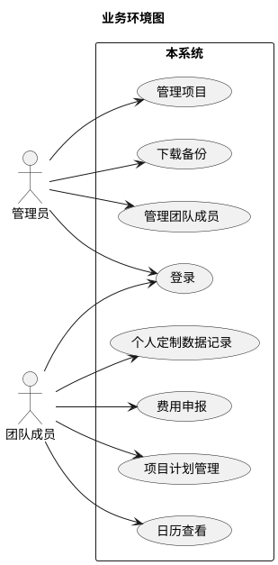
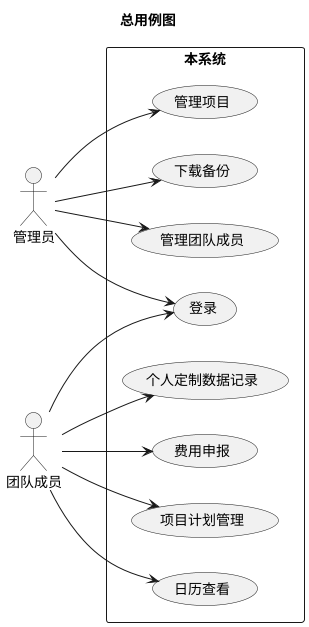

# ocagents
# 软件需求规格说明书

## 版本记录
| 版本号| 修订内容 | 作者 |
|---|---|---|
| 20260611-1 | 初版。基于需求调研结果编制。 | product-manager agent |
| 20260614-2 | 根据评审意见全面修订。 | product-manager |

## 1. 系统概述
本系统是一个基于web的个人和项目管理系统，旨在替代传统的Excel工作簿管理模式。用户可以通过任何支持浏览器的设备随时记录和查看信息，支持团队成员间的协作。系统核心功能包括个人定制数据记录、费用申报、项目计划管理、日历视图和纪念日管理。通过将分散在Excel中的信息整合到统一的web平台，实现信息的随时随地访问和团队协作。

## 2. 业务环境

| 外部角色 | 类型 | 与本系统的业务往来 | 备注 |
|---|---|---|---|
| 管理员 | 人类用户 | 1. 登录系统 2. 管理团队成员 3. 管理项目 4. 下载备份 | 系统配置和数据管理 |
| 团队成员 | 人类用户 | 1. 登录系统 2. 记录个人定制数据 3. 填写费用申报 4. 管理个人任务计划 5. 查看日历和任务 | 主要功能使用者 |

## 3. 术语表
| 术语 | 定义 | 备注 |
|---|---|---|
| 资源名称 | 团队成员的标识，与可登录的用户保持一致 | 任务计划中的执行人 |
| 项目全称 | 项目的完整名称，用于费用申报关联 | 必须唯一，最大长度100字符 |
| 项目简称 | 项目的简称，用于日历中显示 | 如"铁越2025" |
| 个人定制数据记录 | 用户可自定义结构的个人记录表 | 原佛学记录的扩展版本 |
| 阶段 | 项目计划中的阶段划分 | 任务隶属于阶段 |

## 4. 功能性需求
### 4.0. 总用例图

### 4.1. 登录
**需求编号：** SF_001_001  
**优先级：** 5.0  
**参与者：** 管理员、团队成员  
**主要目标：** 用户登录系统。  
**前置条件：** 无。

##### 主成功场景
1. 用户访问系统登录页面。
2. 系统显示登录表单，包含以下字段：
   - 用户名
   - 密码
3. 用户输入用户名和密码。
4. 用户点击"登录"按钮。
   *（验收：用户名必须唯一，密码必须正确。）*
5. 系统验证用户身份。
6. 系统根据用户角色跳转到相应界面，显示"登录成功"消息。

##### 业务规则
*   **BR-001（密码安全）：** 密码必须使用bcrypt哈希算法存储。
*   **BR-002（会话管理）：** 登录后创建会话，超时时间30分钟。

### 4.2. 管理团队成员
**需求编号：** SF_001_002  
**优先级：** 4.5  
**参与者：** 管理员  
**主要目标：** 管理员管理团队成员信息。  
**前置条件：** 管理员已成功登录系统。

##### 主成功场景
1. 管理员进入"管理团队成员"界面。
2. 系统显示团队成员多行表格，包含以下列：
   - 用户名
   - 姓名
   - 邮箱
   - 角色
   - 状态（启用/禁用）
   - 操作（编辑/删除）
3. 管理员可以进行以下操作：
   - 点击"添加成员"按钮
   - 选择成员进行编辑或删除
4. 管理员点击"保存"按钮。
   *（验收：表格实时更新，操作结果即时反馈。）*
5. 系统保存变更，显示"保存成功"消息。

##### 扩展场景
*   **3a. 添加成员：**
    1. 系统弹出添加成员表单。
    2. 系统自动生成合规随机密码，允许管理员手工输入。
    3. 管理员填写成员信息并确认。
    4. 系统创建新用户账户。

##### 业务规则
*   **BR-003（用户名唯一）：** 用户名必须唯一，可作为主键。
*   **BR-004（密码规则）：** 初始密码必须包含大小写字母、数字和特殊字符，长度至少8位。
*   **BR-005（删除限制）：** 不能删除当前登录的管理员账户。

### 4.3. 管理项目
**需求编号：** SF_001_003  
**优先级：** 4.8  
**参与者：** 管理员  
**主要目标：** 管理员管理项目信息。  
**前置条件：** 管理员已成功登录系统。

##### 主成功场景
1. 管理员进入"管理项目"界面。
2. 系统显示项目多行表格，包含以下列：
   - 项目全称
   - 项目简称
   - 项目负责人
   - 项目成员
   - 项目状态
   - 操作（编辑/删除）
3. 管理员可以进行以下操作：
   - 点击"添加项目"按钮
   - 选择项目进行编辑或删除
4. 管理员点击"保存"按钮。
   *（验收：表格实时更新，操作结果即时反馈。）*
5. 系统保存变更，显示"保存成功"消息。

##### 扩展场景
*   **3a. 添加项目：**
    1. 系统弹出添加项目表单。
    2. 管理员填写项目信息，包括：
       - 项目全称（必填，唯一，最大100字符）
       - 项目简称
       - 项目负责人
       - 项目成员
       - 项目状态（售前中/售前失败/运行中/暂停中/已关闭）
    3. 管理员确认添加。

##### 业务规则
*   **BR-006（项目全称唯一）：** 项目全称必须唯一，可作为主键。
*   **BR-007（负责人唯一性）：** 一个项目只能有一个负责人。
*   **BR-008（成员权限）：** 项目成员可以查看和编辑该项目相关的任务计划。

### 4.4. 下载备份
**需求编号：** SF_001_004  
**优先级：** 4.0  
**参与者：** 管理员  
**主要目标：** 管理员下载系统数据备份。  
**前置条件：** 管理员已成功登录系统。

##### 主成功场景
1. 管理员进入"下载备份"界面。
2. 系统显示备份管理界面。
3. 管理员点击"下载备份"按钮。
4. 系统开始创建备份，显示进度条。
   *（验收：备份包含所有用户数据、项目配置、任务记录等。）*
5. 备份完成后，系统自动下载备份文件。

##### 业务规则
*   **BR-009（备份格式）：** 备份文件为ZIP格式，包含JSON数据文件。

### 4.5. 个人定制数据记录
**需求编号：** SF_002_001  
**优先级：** 4.7  
**参与者：** 团队成员  
**主要目标：** 用户记录和查看个人定制数据。  
**前置条件：** 团队成员已成功登录系统。

##### 主成功场景
1. 团队成员进入"个人定制数据记录"界面。
2. 系统显示数据录入界面，包含：
   - 统计信息区域（显示在数据上方）
   - 数据录入多行表格
3. 数据录入表格包含以下列：
   - 公历日期（必填，自动填入当天日期，允许修改）
   - 农历日期（必填，自动计算，允许修改）
   - 自定义字段列（用户自定义）
4. 团队成员可以直接在表格中录入数据。
   *（验收：数据实时保存，无需点击保存按钮。）*
5. 系统自动保存数据记录。

##### 扩展场景
*   **2a. 自定义字段：**
    1. 团队成员点击"自定义字段"按钮。
    2. 系统显示字段配置界面。
    3. 团队成员可以添加/删除字段（仅指定字段名称）。
    4. 系统更新字段配置。

##### 业务规则
*   **BR-010（必选字段）：** 公历日期和农历日期字段必须存在且不可删除。
*   **BR-011（字段数量限制）：** 最多支持50个自定义字段。
*   **BR-012（自动保存）：** 数据录入时自动保存，无需手动保存按钮。

#### 4.5.1. 查看统计
**需求编号：** SF_002_002  
**优先级：** 3.8  
**参与者：** 团队成员  
**主要目标：** 用户查看个人定制数据的统计分析。  
**前置条件：** 团队成员已成功登录系统，已有数据记录。

##### 主成功场景
1. 团队成员在"个人定制数据记录"界面。
2. 系统在数据上方显示统计信息区域。
3. 系统显示统计配置选项：
   - 开始日期选择器
   - 结束日期选择器
4. 团队成员选择统计时间范围。
5. 系统显示统计结果：
   - 总次数（内容非空即计1次）
   - 合计值（对数值加总）
   - 平均值（求数值的平均值）
   - 特殊值处理：如果字段值为"I"，视为数值"1"；"0"表示未完成；"1"表示已完成
   *（验收：统计结果实时计算，准确无误。）*

### 4.6. 费用申报
**需求编号：** SF_003_001  
**优先级：** 4.9  
**参与者：** 团队成员  
**主要目标：** 用户管理费用申报。  
**前置条件：** 团队成员已成功登录系统。

##### 主成功场景
1. 团队成员进入"费用申报"界面。
2. 系统显示费用申报多行表格，包含以下列：
   - 申报者（自动填充当前用户）
   - 费用归属
   - 担当人
   - 服务类型
   - 服务内容
   - 服务日期
   - 服务人天
   - 单价
   - 城际交通（工具/出发地/到达地/金额）
   - 市内交通（工具/出发地/到达地/金额）
   - 住宿费用
   - 其它费用
   - 操作（编辑/删除）
3. 团队成员可以直接在表格中添加、编辑、删除申报记录。
   *（验收：数据实时保存，无需点击保存按钮。）*
4. 系统自动保存申报记录。

##### 业务规则
*   **BR-013（项目关联）：** 费用申报必须关联到具体项目。
*   **BR-014（自动保存）：** 数据录入时自动保存，无需手动保存按钮。

### 4.7. 项目计划管理
**需求编号：** SF_004_001  
**优先级：** 4.8  
**参与者：** 团队成员  
**主要目标：** 用户管理项目计划。  
**前置条件：** 团队成员已成功登录系统。

##### 主成功场景
1. 团队成员进入"项目计划管理"界面。
2. 系统显示项目计划多行表格，按项目->阶段->任务层级展示。
3. 表格包含以下列：
   - 项目全称
   - 项目简称
   - 阶段名称
   - 任务名称
   - 资源名称
   - 计划开始日期
   - 计划结束日期
   - 计划工时
   - 实际开始日期
   - 实际结束日期
   - 实际工时
   - 操作（编辑/删除）
4. 团队成员可以直接在表格中添加、编辑、删除任务。
   *（验收：数据实时保存，无需点击保存按钮。）*
5. 系统自动保存任务记录。

##### 业务规则
*   **BR-015（资源权限）：** 普通成员只能编辑自己负责的任务的实际数据，项目负责人可编辑所有数据。
*   **BR-016（自动保存）：** 数据录入时自动保存，无需手动保存按钮。
*   **BR-017（任务层级）：** 任务隶属于阶段，而非直接隶属项目。

### 4.8. 日历查看
**需求编号：** SF_005_001  
**优先级：** 5.0  
**参与者：** 团队成员  
**主要目标：** 用户查看月视图日历。  
**前置条件：** 团队成员已成功登录系统。

##### 主成功场景
1. 团队成员进入"日历查看"界面。
2. 系统显示日期选择器，允许指定查看某年某月。
3. 系统显示选定月的日历视图。
4. 日历显示：
   - 公历日期
   - 农历日期
   - 当日任务（按权限显示）
   - 有权限的纪念日信息
5. 团队成员可以：
   - 切换到不同年月
   - 查看任务详情（hover显示）
   *（验收：日历加载时间不超过3秒。）*

##### 业务规则
*   **BR-018（任务显示）：** 
   - 有权限的任务显示为"<项目简称>：任务名"
   - 无权限的任务显示为"其他项目事务"、"公司事务"、"个人事务"
   - 三类任务使用不同背景色区分
*   **BR-019（纪念日显示）：** 
   - 有权限的纪念日显示事件描述
   - 无权限的纪念日不显示
   - 纪念日使用特殊背景色

### 4.9. 设置公共纪念日
**需求编号：** SF_006_001  
**优先级：** 3.0  
**参与者：** 管理员  
**主要目标：** 管理员设置公共纪念日。  
**前置条件：** 管理员已成功登录系统。

##### 主成功场景
1. 管理员进入"设置公共纪念日"界面。
2. 系统显示纪念日管理多行表格，包含以下列：
   - 事件名称
   - 日期基准（公历/农历）
   - 日期
   - 备注
   - 操作（编辑/删除）
3. 管理员可以添加/编辑/删除公共纪念日。
   *（验收：公共纪念日所有团队成员可见。）*
4. 系统自动保存纪念日记录。

##### 业务规则
*   **BR-020（日期基准）：** 支持按公历/农历日期设置，以年为周期。

### 4.10. 设置个人纪念日
**需求编号：** SF_006_002  
**优先级：** 3.2  
**参与者：** 团队成员  
**主要目标：** 用户设置个人纪念日。  
**前置条件：** 团队成员已成功登录系统。

##### 主成功场景
1. 团队成员进入"设置个人纪念日"界面。
2. 系统显示纪念日管理多行表格，包含以下列：
   - 事件名称
   - 日期基准（公历/农历）
   - 日期
   - 备注
   - 操作（编辑/删除）
3. 团队成员可以添加/编辑/删除个人纪念日。
   *（验收：个人纪念日仅自己可见。）*
4. 系统自动保存纪念日记录。

##### 业务规则
*   **BR-021（日期基准）：** 支持按公历/农历日期设置，以年为周期。

## 5. 非功能性需求
### 5.1. 标准与规范
| 需求编号 | 优先级 | 标准与规范 | 备注 |
|---|---|---|---|
| SQ_标准_001 | 2.0 | 系统响应时间在标准网络环境下不超过3秒 | |

### 5.2. 运行环境
| 需求编号 | 优先级 | 名称 | 型号 | 关键参数 | 备注 |
|---|---|---|---|---|---|
| SQ_运行环境_001 | 4.0 | Web服务器 | Nginx | 版本：1.20+ | 支持免费服务器部署 |
| SQ_运行环境_002 | 4.0 | 数据库 | SQLite | 版本：3.35+ | 轻量级，适合免费环境 |
| SQ_运行环境_003 | 4.0 | 操作系统 | Linux | 版本：Ubuntu 20.04 LTS | 兼容主流免费服务器 |
| SQ_运行环境_004 | 3.5 | 浏览器 | Chrome/Firefox/Safari | 版本：最新版本 | 支持移动端访问 |

### 5.3. 接口
无

### 5.4. 安全
| 需求编号 | 优先级 | 需求描述 | 备注 |
|---|---|---|---|
| SQ_安全_001 | 4.8 | 用户密码必须使用bcrypt哈希存储 | 密码重置功能需验证邮箱 |
| SQ_安全_002 | 4.0 | 系统需有基本的防SQL注入措施 | 使用参数化查询 |
| SQ_安全_003 | 3.5 | 管理员操作需记录日志 | 包括操作时间、操作人、操作内容 |

### 5.5. 性能
| 需求编号 | 优先级 | 需求描述 | 备注 |
|---|---|---|---|
| SQ_性能_001 | 4.5 | 日历页面加载时间不超过3秒 | 在标准网络环境下测试 |
| SQ_性能_002 | 4.0 | 支持50个用户同时在线 | 按团队规模预估 |
| SQ_性能_003 | 3.8 | 数据导出操作响应时间不超过5秒 | |
| SQ_性能_004 | 3.5 | 搜索功能响应时间不超过2秒 | |

### 5.6. 国际化
| 需求编号 | 优先级 | 需求描述 | 备注 |
|---|---|---|---|
| SQ_国际化_001 | 2.0 | 系统界面仅支持中文 | |
| SQ_国际化_002 | 1.5 | 日期格式支持YYYY-MM-DD | |

## 6. 其它需求
| 需求编号 | 优先级 | 需求描述 | 备注 |
|---|---|---|---|
| SR_其它_001 | 3.0 | 系统应支持免费服务器部署 | 如GitHub Pages、Cloudflare Pages等 |
| SR_其它_002 | 2.5 | 系统应考虑中国大陆网络环境 | 优化CDN和资源加载 |
| SR_其它_003 | 2.0 | 系统应提供基本的错误提示 | 友好的用户界面提示 |

## 7. 业务数据
| 数据实体 | 描述 | 关键属性/字段 | 生命周期/保留期 | 备注 |
|---|---|---|---|---|
| 用户 | 系统用户账户 | - 用户ID (主键) - 用户名 - 密码哈希 - 姓名 - 邮箱 - 角色（管理员/成员） - 状态（启用/禁用） | 永久保存 | 用户名唯一，可作为主键 |
| 项目 | 项目信息 | - 项目ID (主键) - 项目全称 - 项目简称 - 项目负责人 - 项目成员 - 项目状态（售前中/售前失败/运行中/暂停中/已关闭） - 创建时间 | 永久保存 | 项目全称唯一，可作为主键 |
| 阶段 | 项目阶段 | - 阶段ID (主键) - 项目ID - 阶段名称 - 开始日期 - 结束日期 | 项目存在期间有效 | 任务隶属于阶段 |
| 任务 | 项目任务 | - 任务ID (主键) - 阶段ID - 任务名称 - 资源ID - 计划开始日期 - 计划结束日期 - 计划工时 - 实际开始日期 - 实际结束日期 - 实际工时 - 备注 | 永久保存 | |
| 费用申报 | 费用申报记录 | - 申报ID (主键) - 申报者ID - 费用归属 - 担当人 - 服务类型 - 服务内容 - 服务日期 - 服务人天 - 单价 - 城际交通（工具/出发地/到达地/金额） - 市内交通（工具/出发地/到达地/金额） - 住宿费用 - 其它费用 - 创建时间 | 永久保存 | |
| 个人定制数据 | 个人定制记录 | - 记录ID (主键) - 用户ID - 公历日期 - 农历日期 - 自定义字段值 - 创建时间 | 永久保存 | 字段结构可自定义 |
| 公共纪念日 | 公共纪念日记录 | - 纪念日ID (主键) - 事件名称 - 日期基准（公历/农历） - 日期 - 备注 | 永久保存 | 所有团队成员可见 |
| 个人纪念日 | 个人纪念日记录 | - 纪念日ID (主键) - 用户ID - 事件名称 - 日期基准（公历/农历） - 日期 - 备注 | 永久保存 | 仅自己可见 |

## 8. 附录
### 8.1. 界面快速原型
- **RP-001：登录界面**：用户名和密码输入框，登录按钮
- **RP-002：管理团队成员界面**：多行表格显示成员信息，支持添加、编辑、删除
- **RP-003：管理项目界面**：多行表格显示项目信息，支持添加、编辑、删除，包含负责人和成员管理
- **RP-004：个人定制数据记录界面**：统计信息区域 + 数据录入多行表格，支持自定义字段
- **RP-005：费用申报界面**：多行表格显示申报记录，支持添加、编辑、删除
- **RP-006：项目计划管理界面**：多行表格显示项目->阶段->任务层级，支持添加、编辑、删除
- **RP-007：日历查看界面**：日期选择器 + 月视图日历，显示任务和纪念日
- **RP-008：设置公共纪念日界面**：多行表格显示公共纪念日，支持添加、编辑、删除
- **RP-009：设置个人纪念日界面**：多行表格显示个人纪念日，支持添加、编辑、删除

### 8.2. 接口协议文档
无

## 待确认事项
1. **农历日期字段可选性**：评审意见要求个人定制数据记录的农历日期作为必选字段，但用户在需求调研阶段明确表示农历日期为可选字段。建议确认农历日期字段是否应为可选字段。

模板版本号：20260219-1
